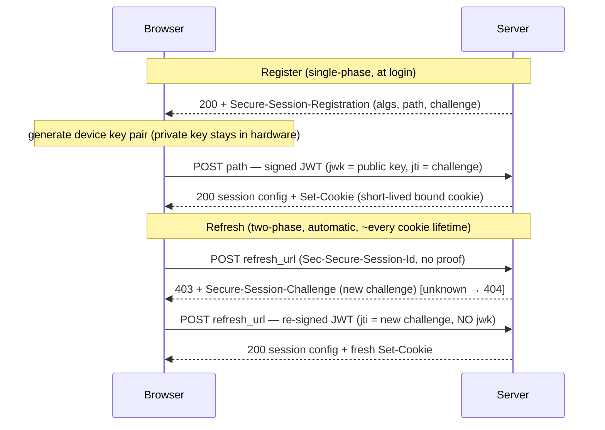

# Device Bound Session Credentials (DBSC)

Technical notes on the DBSC handshake, with a minimal Rust/axum server that logs every request and
response so you can watch the protocol on the wire (including a WebSocket probe).

---

## 1. Problem and idea

A stolen session cookie replays from anywhere — malware copies it and reuses it from the attacker's
machine. **DBSC** binds a session to a **private key that lives in the device's hardware** (Secure
Enclave on macOS, TPM on Windows) and never leaves it:

- At login the **browser** generates a device key pair and proves possession by signing a challenge.
  The server stores the **public** key.
- The server issues a **short-lived** bound cookie.
- Just before it expires, the browser **automatically** re-proves possession to mint a new cookie —
  no page JavaScript.

A thief who copies only the cookie can't refresh it (no private key), so the stolen session dies
within one cookie lifetime.

**The bound cookie is not signed or encrypted.** It's a plain opaque bearer token; requests are not
individually signed. The private key's only job is to **sign the challenge at refresh**. Security is
*short cookie life × only-the-device-can-refresh*, not per-request cryptography. The server validates
the cookie by **comparing it to the stored value** (constant-time), not by verifying a signature on it.

```
Private key → signs the CHALLENGE at refresh → mints a new short-lived cookie
Cookie      → plain token, sent normally      → proves "I hold a currently-valid session"
```

---

## 2. The protocol

Headers (current names; older docs show the obsolete `Sec-Session-*`):

| Header | Direction | Purpose |
|--------|-----------|---------|
| `Secure-Session-Registration` | server → browser | invite to register (algs, path, challenge) |
| `Secure-Session-Response` | browser → server | the signed proof JWT |
| `Secure-Session-Challenge` | server → browser | refresh challenge (`"<nonce>";id="<session>"`) |
| `Sec-Secure-Session-Id` | browser → server | which session a refresh is for |

- **Register — single-phase.** The server attaches `Secure-Session-Registration` to a response it
  already sends (in production, the login response — a `200` or a `303`/`302` redirect; **not** 401/403).
  The browser generates the device key pair and POSTs a signed JWT to the advertised `path`. The
  server verifies it, stores the key under a new `session_identifier`, and returns the session config
  plus the first short-lived bound cookie.
- **Refresh — two-phase.** When the bound cookie nears expiry the browser POSTs the `refresh_url`
  with no proof → server replies **`403` + `Secure-Session-Challenge`** → browser re-signs (same
  device key, new challenge) and retries → server verifies against the **stored** key and re-mints
  the cookie. Unknown session → **`404`** (so the browser drops it).



Registration is server-*initiated*, so the challenge is bundled into the invite (single-phase).
Refresh is browser-*initiated*, so there's no invite — the server hands back a standalone challenge
in a `403` (two-phase).

---

## 3. The proof JWT

Compact JWS (`header.payload.signature`), signed with **ES256** (P-256 + SHA-256).

- **`jwk`** (in the JWT *header*) — the device's **public** key (EC `x`/`y` coordinates). Sent **only
  at registration**; the server stores it and verifies every future proof against it. **Absent on
  refresh** — the key is already known.
- **`jti`** (a claim) — the server's challenge echoed back, proving the signature is **fresh** (not a
  replay). Present on **both** register and refresh. A real server checks `jti == the challenge it issued`.

### jwk → a verifiable key

An EC public key is a point `(x, y)` on P-256. The JWK carries `x`/`y` as base64url 32-byte
big-endian integers. To verify:

1. base64url-decode `x` and `y` → 32 bytes each.
2. Concatenate into the SEC1 **uncompressed point** `0x04 || X || Y` (65 bytes; `0x04` = "uncompressed").
3. `VerifyingKey::from_sec1_bytes(&sec1)`.
4. `vk.verify(signing_input, sig)` where `signing_input` = the literal `header.payload` bytes and
   `sig` = the JWT's raw 64-byte `r‖s` signature (**not** DER).

### Why refresh must not trust an incoming `jwk`

If a refresh proof carried its own `jwk` and the server verified against **that**, a thief who stole
the cookie could generate their own key pair, put their public key in the `jwk`, sign with their
private key, and pass. By verifying only against the **stored** key, only the original device can
produce a valid refresh. Registration *enrolls* the key; refresh *matches* against the enrolled key —
you never re-enroll on refresh.

---

## 4. The session config

The `200` for register **and** refresh carries a JSON config that lets the browser run the session
unattended:

```json
{
  "session_identifier": "…",
  "refresh_url": "/dbsc/refresh",
  "scope": { "origin": "https://example.com", "include_site": false },
  "credentials": [{ "type": "cookie", "name": "__Host-auth_cookie",
                    "attributes": "Path=/; Secure; HttpOnly; SameSite=Lax" }]
}
```

| Field | Meaning |
|-------|---------|
| `session_identifier` | Handle echoed back as `Sec-Secure-Session-Id` on every refresh; the server's lookup key. |
| `refresh_url` | Where the browser POSTs renewals. Auto-excluded from scope so refreshes aren't themselves deferred. |
| `scope.origin` / `include_site` | Which origin/site the session governs (`include_site:true` spans subdomains). |
| `scope.scope_specification` | *Optional* `include`/`exclude` rules by path. Omitted → all paths on the origin. |
| `credentials.name` | Must match the `Set-Cookie` name or the browser won't link them. |
| `credentials.attributes` | Attribute template for the managed cookie (mirrors `Set-Cookie`, minus `Max-Age`). |

---

## 5. IDs and lifetimes

Several values with very different lifetimes; don't mix them up.

| Value | Born | Rotates? | Lives for |
|-------|------|----------|-----------|
| **device key** (public stored, private in hardware) | registration | no | the whole login session — the real anchor |
| **`session_identifier`** | registration | no | the whole login session — stable handle to the binding |
| *(prod)* **login/session cookie** | login | maybe | the whole login session |
| **bound cookie value** | every register & refresh | **yes, every refresh** | ~one refresh cycle (`Max-Age`) |
| **refresh challenge** | every refresh (`403`) | **yes, single-use** | until used / next refresh |
| **registration challenge** | the register invite | one-time | the registration handshake |

The thing that persists all session is **not a secret you send around** — it's the device key (plus
its stable handle and, in production, the login cookie). The credential that travels (the bound
cookie) and the challenge are deliberately short-lived and rotating. That's the whole trick: *a
permanent hardware anchor issuing disposable credentials.*

`session_identifier` is stable **per login session** — reused across every refresh, tab close, and
multi-day return while the session is valid; a new login → new registration → new id. One login
session ↔ one `session_identifier`; tie its lifetime to your login/session TTL.

---

## 6. Server-side state (production)

DBSC's guarantee lives in server state. It's **per session** — a user has many (one per
device/browser), so index it so you can list/revoke per user.

- **Key by your stable app session id, in a dedicated key space** (Redis, a table) — **never** inside
  a read-modify-written shared "session blob." The post-login navigation races the `/dbsc/register`
  POST; last-writer-wins clobbers the binding and enforcement silently no-ops — the exact hole DBSC
  closes.
- **Never store the private key** — you only ever receive and store the public key.
- Invariant: **`challengeTtl > cookieMaxAge`**, so a challenge cached just before cookie expiry is
  still valid when used. **Overlap windows** (accept the single previous cookie/challenge value)
  tolerate refresh/request latency races.

**Binding** — durable; created on a successful register; its existence *is* the "device-bound" mark:

| Field | Why |
|-------|-----|
| `user_id` | owner — list/revoke a user's device sessions |
| `session_identifier` | lookup key on every refresh |
| `device_public_key` | **the crux** — every refresh proof is verified against this |
| `algorithm` | pin (`ES256`); reject anything else |
| `current_cookie_value` | constant-time compared at the gate; rotates every refresh |
| `current_challenge` + issued_at | the `jti` the next refresh must carry; drives the TTL check |
| `created_at` / `expires_at` | grace window / tie to session lifetime |

**PendingRegistration** — transient; written when you offer registration, deleted on success:
`user_id`, `registration_challenge`, `created_at`.

**Enforcement** (the payoff): **reject** on every failed check — `alg≠ES256`, bad signature,
`jti ≠ issued` — on **both** register and refresh, constant-time. On protected routes, if a binding
exists but the presented bound cookie is missing/mismatched, **revoke + log out** (don't just report
unauthenticated); skip the gate on the `/dbsc/*` endpoints. **Revoke** on logout: delete state +
emit a cookie deletion.

---

## 7. Gotchas

- **HTTPS is mandatory** — `http://localhost` is a secure context but not a *cryptographic* transport;
  the registration header is silently ignored. Use a trusted cert (`mkcert`), not bare self-signed.
- **The refresh challenge must be `403`**, not 401 — Chrome only re-signs on 403.
- **Read *all* `Cookie` headers.** HTTP/2 (which Chrome uses over TLS) can split cookies across
  multiple `Cookie` headers, and the DBSC-managed cookie may land in its own. Reading only the first
  misses it — use the equivalent of `get_all`.
- **Mint a fresh cookie value every refresh.** Re-emitting the old value makes Chrome think no refresh
  happened and drop the session.
- **Reject unknown sessions with `404`.** The browser persists sessions; after a server restart,
  without a `404` they refresh forever (a storm).
- **Pin ES256** — reject `alg=none` / RS-with-EC-key confusion before touching the signature.
- **Cookie hardening** — `__Host-` prefix (host-only + `Secure` + `Path=/`), `HttpOnly`, and
  `SameSite=Lax`. (`Strict` drops the cookie on external top-level links — a login-UX cost for no real
  gain on a hardware-bound, frequently-refreshed cookie. `Domain=` is not required.)
- **The challenge is just a structured-field string** — length/charset don't matter; use a
  crypto-random, single-use value.

---

## 8. DBSC over WebSockets

A WebSocket connection begins as an **HTTP `GET` with `Upgrade: websocket`** — the *handshake*.
Cookies ride that request (never the individual frames), so **DBSC applies to the handshake exactly
like any credentialed HTTP request**: the bound cookie attaches, and the browser refreshes/defers as
needed. Verified: the cookie is delivered on `wss://` upgrades, kept continuously fresh and
device-bound; behaviour at connect time is identical to HTTP.

**DBSC does not cover an already-open socket.** The cookie is checked **once, at the upgrade**; frames
carry none, so there's no further checkpoint. A socket opened while the session was valid keeps
running after the cookie expires *or the session is revoked* — verified by holding a stream open
across many cookie rotations and a revoke, untouched. Revocation/expiry only bites on the **next
handshake** (a reconnect).

> **Model:** DBSC gates *requests*. The WS handshake is a request (gated); the open connection is not
> (no checkpoints); a reconnect is a new request (gated again).

For mid-stream enforcement you must handle it at the app layer: close live sockets on revoke, or
re-auth in-band periodically. DBSC hardens *getting* the connection; keeping a long-lived one secure
is on you.

---

## 9. Run the demo

**Requirements:** a trusted TLS cert and Chrome DBSC flags (DBSC only runs over real TLS).

```bash
brew install mkcert && mkcert -install
mkcert localhost 127.0.0.1 ::1        # -> localhost+2.pem / localhost+2-key.pem
cargo run                              # https://localhost:3000
```

Chrome (`chrome://flags`, then relaunch): **Device Bound Session Credentials (Standard)** →
`Enabled – For developers`, and **UnexportableKeyService** (`#use-unexportable-key-service-in-browser-process`).
Open `https://localhost:3000`, DevTools → Network, and watch the terminal.

**Config (env, defaults = local mkcert):** `DBSC_ORIGIN`, `DBSC_BIND`, `DBSC_TLS_CERT`, `DBSC_TLS_KEY`,
`DBSC_COOKIE_NAME` (`__Host-auth_cookie`), `DBSC_COOKIE_MAX_AGE` (seconds, `300`; set `20` to watch
refreshes quickly).

**Endpoints:** `POST /start-form` (emits the registration invite — stands in for login),
`POST /dbsc/register`, `POST /dbsc/refresh`, `GET /api/protected` (reports cookie delivery),
`GET /ws` (delivery over a WS handshake), `GET /ws-stream` (keep-alive WS — shows the open-socket
caveat), `GET /logout` (revoke). This demo **logs and continues** on the ES256 signature (it checks
the `jti`); a real server rejects on every failed check (§6).

---

## 10. References

- Spec: <https://w3c.github.io/webappsec-dbsc/>
- Chrome docs: <https://developer.chrome.com/docs/web-platform/device-bound-session-credentials>
- Testing guide (flags): <https://github.com/w3c/webappsec-dbsc/wiki/Testing-early-versions-of-DBSC>
- Reference test server (Chrome team, Deno): <https://github.com/drubery/dbsc-test-server>
- Production library (PHP, with attack-case tests): <https://github.com/report-uri/dbsc-php>
