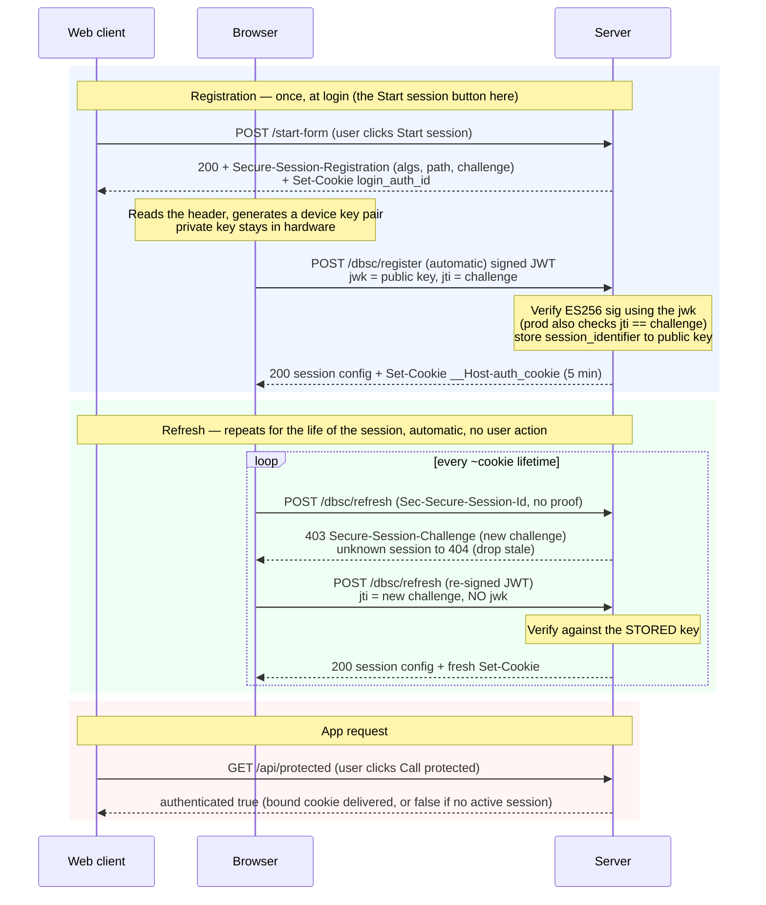

# DBSC hello-world

A minimal Rust (axum) HTTPS server that makes the **Device Bound Session Credentials
(DBSC)** handshake *visible*, so you can learn it by watching real requests. Every DBSC
header is logged to the terminal.

---

## 1. What DBSC is (the 60-second version)

Cookie theft is a big account-takeover vector: malware copies your session cookie and
replays it from the attacker's machine. **DBSC** defeats replay by binding a session to a
**private key that lives in the device's hardware** (Secure Enclave on macOS, TPM on
Windows) and never leaves it.

- On login, the **browser** generates a device key pair and proves possession of the
  private key by signing a challenge. The server stores the **public** key.
- The server issues a **short-lived** cookie (e.g. 5 min here).
- Just before that cookie expires, the browser **automatically** re-proves possession
  (signs a fresh challenge) to get a new cookie — no page JavaScript involved.

A thief who copies only the cookie can't refresh it (they don't have the private key), so
the stolen session dies within seconds on their machine.

The whole crypto dance is done by the browser. **The server just:** (1) invites
registration, (2) verifies the signed proof and sets a cookie, (3) re-verifies on refresh.

> **Common misconception — the bound cookie is NOT encrypted or signed with the private key.**
> It's a **plain, opaque bearer token** (a random string), sent as an ordinary cookie; requests
> are **not** individually signed either. The private key's *only* job is to **sign the challenge
> at refresh** (proof-of-possession) to mint a new cookie. So the security is not "the cookie is
> cryptographic" — it's **short cookie life × only the device can refresh**:
>
> ```
> Private key → signs the CHALLENGE at refresh   → mints a new short-lived cookie
> Cookie      → plain token, sent normally        → proves "I hold a currently-valid session"
> ```
>
> A stolen cookie therefore works only until it **expires** (the thief can't refresh it) — DBSC
> shrinks the theft window from "forever" to one cookie lifetime, rather than making each request
> cryptographically signed (which would need heavy browser/JS changes). On the server, the cookie
> value is validated by **comparing it to the stored value** for the session (constant-time), not
> by decrypting or verifying a signature on it.

---

## 2. Endpoints (8)

| Method & path         | Who calls it            | What it does |
|-----------------------|-------------------------|--------------|
| `GET  /`              | Web client (you)        | Serves the demo page. |
| `POST /start-form`    | Web client (Start session button) | Replies **200** with a `Secure-Session-Registration` header + a `login_auth_id` cookie (a stand-in for your login session — §3). This 200 response (like a real login) is what makes the browser start DBSC. |
| `POST /dbsc/register` | **Browser (automatic)** | Receives the signed proof JWT (`Secure-Session-Response`). The JWT **header** embeds the device **public key** as a `jwk`; the **claims** echo our challenge back as the `jti`. We verify the ES256 signature, store the key under a new `session_identifier`, and return the **session config** JSON + a short-lived bound cookie. |
| `POST /dbsc/refresh`  | **Browser (automatic)** | Called when the bound cookie needs refreshing. First hit has no proof → we reply **403 + `Secure-Session-Challenge`**. The browser re-signs (same device key; new challenge as `jti`, **no `jwk`**) and retries → we verify against the **stored** key and re-mint the cookie. Unknown session → **404** (drops stale sessions). |
| `GET  /api/protected` | Web client (Call protected button) | Reports whether the device-bound cookie was delivered (`authenticated: true/false`). |
| `GET  /ws`            | Web client (Call protected (WebSocket) button) | Same delivery check over a **WebSocket handshake** — to test whether DBSC/the bound cookie covers WebSockets. Reads the cookie from the HTTP **upgrade** request, replies with one JSON frame, then closes (§11). |
| `GET  /ws-stream`     | Web client (Open WS stream button) | **Keep-alive** WebSocket: checks the cookie **once** at the upgrade, then holds the socket open and streams a tick every 3s. Demonstrates that DBSC guards the *handshake*, not the *open connection* — the socket survives cookie expiry / revoke (§11). |
| `GET  /logout`        | Web client (Logout button) | **Revoke**: deletes the server-side `Binding`, expires the bound cookie, and sends `Clear-Site-Data` to end the DBSC session. A future refresh then gets `404`. |

Header names are `Secure-Session-*`; Chrome's docs get these right — it's older blog posts
/ search results that still show the obsolete `Sec-Session-*` (don't copy those). Session
id on refresh is `Sec-Secure-Session-Id`.

---

## 3. The flow (sequence diagram)

Three participants: **Web client** = the page / user-initiated requests · **Browser** =
Chrome's DBSC engine making calls automatically, no user action · **Server** = this app.



Plain-text version:

```
── Registration (once, at "login") ──────────────────────────────────
You     → POST /start-form
Server  → 200  + Secure-Session-Registration (algs, path, challenge)
               + Set-Cookie login_auth_id (login stand-in)
Browser makes a device key pair (private key stays in hardware)
Browser → POST /dbsc/register   (signed JWT: jwk = public key, jti = challenge)
Server verifies sig via jwk, stores session_identifier → public key,
        → 200 session config + Set-Cookie __Host-auth_cookie (5 min)

── Refresh (repeats every ~cookie lifetime, automatic) ──────────────
Browser → POST /dbsc/refresh    (Sec-Secure-Session-Id, no proof)
Server  → 403 + Secure-Session-Challenge (new challenge)   [unknown session → 404, dropped]
Browser → POST /dbsc/refresh    (re-signed JWT: jti = new challenge, NO jwk)
Server verifies vs STORED key,  → 200 session config + fresh Set-Cookie

── App request ──────────────────────────────────────────────────────
You     → GET /api/protected
Server  → authenticated true   (bound cookie rode the request; false only if no active session)
```

**What's inside the proof JWT** (a compact JWS — `header.payload.signature`):

- **`jwk`** (in the JWT *header*) — the device's **public** key (EC P-256 `x`/`y` coordinates).
  Sent **only at registration**; the private half never leaves the hardware. The server stores
  this jwk and verifies every future proof against it. On **refresh there is no `jwk`** — the
  key is already known, so re-sending it would defeat the point.
- **`jti`** (a JWT *claim*) — the **challenge** the server issued, echoed back. It proves the
  signature is **fresh**, not a replay. Present on **both** the register and refresh JWTs (each
  carries whatever challenge the server most recently issued). A production server checks
  `jti == the challenge it sent`; this demo logs it (see §5). The signature covers
  `header.payload`, so a valid signature proves possession of the private key *and* binds this
  exact challenge.

### From `jwk` to a verifiable key (how the server rebuilds the public key)

An EC public key **is a point `(x, y)` on the P-256 curve** (the private key is a secret number
`d`; the public key is the point `d·G`). The `jwk` just carries those two coordinates as
**base64url-encoded, 32-byte big-endian integers**. "Getting the public key from the `jwk`" means
converting those two strings into the byte format the crypto library expects. Worked example from
a real registration JWT header:

```json
"jwk": { "kty":"EC", "crv":"P-256",
         "x":"DA_3CaScQDr_kHODhKDgBxd8293dH3XRPmJcRNd-oNU",
         "y":"V5XJ0ZRAZQA0t3SR5ZkA80nvjNUdt_90AvoekPXQtgc" }
```

1. **Pull `x` and `y`** out of the JWK JSON (`pubkey_from_jwk` in `main.rs`) — still just strings.
2. **base64url-decode each → 32 raw bytes** (P-256 coordinates are 32 bytes; the code rejects
   anything else):
   ```
   x = 0c0ff709 a49c403a ff907383 84a0e007 177cdbdd dd1f75d1 3e625c44 d77ea0d5
   y = 5795c9d1 94406500 34b77491 e59900f3 49ef8cd5 1db7ff74 02fa1e90 f5d0b607
   ```
3. **Concatenate into the SEC1 *uncompressed point*** — `0x04 || X || Y` (1 + 32 + 32 = 65 bytes).
   The leading `0x04` is the SEC1 tag meaning "uncompressed — both coordinates follow":
   ```
   04 0c0ff709…d77ea0d5 5795c9d1…f5d0b607
   ```
4. **Parse it:** `VerifyingKey::from_sec1_bytes(&sec1)` turns those 65 bytes into a usable key.

Then verify: `vk.verify(signing_input, sig)` where `signing_input` = the literal `header.payload`
bytes and `sig` = the JWT's raw 64-byte `r‖s` signature (not DER). Success ⇒ the device holds the
private key matching that point.

**Why the `04 || X || Y` dance?** JWK and the crypto library describe the *same* key in *different*
formats — JWK as "two base64url numbers," SEC1 as "one byte string." Step 3 is purely a format
conversion. (A production server does the identical thing via a helper, e.g. `dbsc-php` uses
`jwkToPem` then verifies with OpenSSL.)

**Registration vs refresh:** the `jwk` is present **only at registration** — that's when you run
these steps and **store** the resulting key. On **refresh there is no `jwk`**, so you verify
against the **stored** key. That's the anti-theft core: refresh proofs are always checked against
the key captured once at registration, so only the original device can produce them.

**Why refresh must NOT trust a `jwk` (it would be self-certifying).** This is the crux, worth
spelling out. Suppose refresh JWTs *did* carry a `jwk` and the server verified against **that**
attached key. Then a thief who stole the cookie could: generate **their own** key pair → put
**their** public key in the `jwk` → sign the challenge with **their** private key → and the
signature verifies against the attached key ✅. The signature would prove only "I own *some*
key" — meaningless, and anyone could do it. By **ignoring any incoming key and checking against
the stored one**, only the holder of the **original** device private key (enrolled once, living
in hardware) can produce a valid refresh — a stolen cookie plus the attacker's own key **fails**.
That is exactly why the bound cookie can't just be replayed. Mental model: registration *enrolls*
the key ("remember this public key"); refresh *matches against the enrolled key* — you never
re-enroll a new key on refresh, or the lock would be meaningless. (This server verifies against
`stored_key` only; even if a refresh JWT included a `jwk`, it would be ignored.)

### The session config (the JSON body of Flows 2 & 4)

The `200` response to register **and** refresh carries a JSON **session config** — the server's
instruction sheet that lets Chrome run the whole session on its own (no page JavaScript). Example:

```json
{
  "session_identifier": "sess3",
  "refresh_url": "/dbsc/refresh",
  "scope": {
    "origin": "https://localhost:3000",
    "include_site": false
  },
  "credentials": [ { "type": "cookie", "name": "__Host-auth_cookie",
                     "attributes": "Path=/; Secure; HttpOnly; SameSite=Lax" } ]
}
```

| Field | Meaning / what Chrome does with it |
|-------|------------------------------------|
| **`session_identifier`** | Handle for this session; Chrome echoes it back as `Sec-Secure-Session-Id` on every refresh so the server knows which stored key to verify against. |
| **`refresh_url`** | **Where Chrome POSTs to renew the cookie** when it nears expiry. Chrome **auto-excludes** this URL from the scope so refresh requests aren't themselves deferred. |
| **`scope`** | **Which requests this session governs** — which must carry a fresh bound cookie (and which Chrome defers + refreshes for). |
| ↳ `origin` | The origin the session belongs to. |
| ↳ `include_site` | `false` = **this origin only** (no subdomain span); `true` = the whole registrable site (`*.example.com`). |
| ↳ `scope_specification` *(optional — we omit it)* | `include`/`exclude` rules by domain+path. **This demo omits it** (like `dbsc-php`), so Chrome manages the cookie for **all paths** on the origin by default. Add it with `exclude` rules (e.g. `/static`) to leave paths unmanaged. |
| **`credentials`** | **Which cookie(s) Chrome treats as device-bound and keeps fresh.** |
| ↳ `name` | Must **match the `Set-Cookie` name** (`__Host-auth_cookie`) or Chrome won't link them. |
| ↳ `attributes` | The attribute template for the managed cookie (mirrors the `Set-Cookie`, minus `Max-Age`). |

So after Flow 2 Chrome knows: *"for requests in **scope**, keep the cookie named `__Host-auth_cookie`
fresh; when it's about to expire, POST to **`refresh_url`** with **`session_identifier`**, get a
new cookie, carry on."* That's what makes the register/refresh loop self-sustaining — the config
is returned on **both** register and refresh so Chrome always holds the current instructions.

### Every id / value and how long it lives — don't mix them up

DBSC juggles several ids and values with **very different lifetimes**. Confusing them is the #1
source of "wait, which one is this?" Here they all are, grouped by lifetime:

| Value | Example | Born when | Rotates? | Lives for | Whole session? |
|-------|---------|-----------|----------|-----------|:---:|
| **device key** (public stored server-side; private in hardware) | — | Registration (Flow 2) | No | **the whole login session** | ✅ |
| **`session_identifier`** (the "session id") | `sess3` | Registration (Flow 2) | No — stable | **the whole login session** | ✅ |
| *(production)* **login/session cookie** ("auth token") | — | Login | No (maybe rotated) | **the whole login session** | ✅ |
| **bound cookie value** (`__Host-auth_cookie`) | `cookie4` → `cookie6` → … | Every register **and** refresh | **Yes — every refresh** | ~one refresh cycle (`Max-Age=300s`) | ❌ |
| **refresh challenge** | `refchal5` → `refchal7` | Every refresh (`403`) | **Yes — every refresh**, single-use | until used / next refresh (< challenge TTL) | ❌ |
| **registration challenge** | `chal1` | Flow 1 invite | One-time | just the registration handshake | ❌ |
| **login/correlation cookie** (`login_auth_id`) | `login2` | Flow 1 | One-time | registration window (minutes); **in prod = your login session cookie** | ❌ |

Read it as three tiers:

- **Lives the whole session (the "anchors"):** the **device key** (the real anchor — everything
  is verified against it), its stable handle **`session_identifier`**, and in production the
  **login cookie**. These persist across every refresh, tab close, and multi-day return.
- **Rotates on every refresh (the security churn):** the **bound cookie value** and the **refresh
  challenge**. Being short-lived and single-use is the *point* — it's what makes a stolen cookie
  useless within seconds.
- **One-time / setup only:** the **registration challenge** (signed once) and the **correlation
  cookie** (bridges login→register during setup; doesn't exist in production).

**The key insight:** the thing that persists all session is **not a secret you send around** — it's
the **device key** (plus its handle and, in prod, the login cookie). The credential that actually
travels (the bound cookie) and the challenge are deliberately **short-lived and rotating**. That's
the whole DBSC trick: *a permanent hardware anchor issuing ever-changing, disposable credentials.*

#### What "the session id is stable" really means

The `session_identifier` is created **once, at registration**, and then **reused for the
entire life of that login session** — through every automatic refresh, even if the user
closes the tab and comes back days later. It is **not** regenerated on refresh (only the
*cookie value* is). Think of it as a **handle to a server-side binding**
(`session_identifier → device public key`), and that binding lives as long as the login
session does.

So it is *stable per login session*, **not** a permanent per-user value:

- **Same login session** (refreshes, tab closed & reopened, returning after days while the
  session is still valid) → **same `session_identifier`**. The bound cookie has expired, but
  Chrome silently refreshes it under the same id — no re-login, invisible to the user.
- **A new login** (the previous session expired, the user logged out, or you revoked it) →
  a **brand-new registration → brand-new `session_identifier`** bound to a fresh key proof.
  You do **not** reuse the old id for a new login — each session gets its own (so you can
  revoke them independently); the reference servers even *reject* re-registering an
  already-bound session.

**The rule in one line:** one login session ↔ one `session_identifier`. Stable while that
session lives; new only when the user registers again. Its lifetime is **your** decision — it
lives exactly as long as the server-side binding, which you tie to your login/session TTL
(a 30-day "remember me" keeps the same id for weeks; a short session rotates it sooner).

> In this demo there is no real login, so the store is keyed directly by the
> `session_identifier` and every "Start session" click is a brand-new session. A production
> server keys its binding by the **stable app session id** instead, and treats the
> `session_identifier` as a separate nonce the browser echoes back (see §9.3).

### The two "path"s in Flow 1 are unrelated

Flow 1's response has two tokens that both say "path" — they live on **different headers** and
mean **completely different things**. The name collision trips everyone up:

```
Secure-Session-Registration: (ES256); path="/dbsc/register"; challenge="…"   ← header #1
Set-Cookie: login_auth_id=login11; Path=/; Max-Age=3600                        ← header #2
```

| Token | On which header | Kind | What it means |
|-------|-----------------|------|---------------|
| `path="/dbsc/register"` | `Secure-Session-Registration` | a **DBSC parameter** | The **endpoint** Chrome should POST the signed proof JWT to. |
| `Path=/` | `Set-Cookie` | a **standard cookie attribute** ([RFC 6265](https://datatracker.ietf.org/doc/html/rfc6265)) | The **URL scope** of the correlation cookie — which requests the browser attaches it to. |

- `path="/dbsc/register"` is a DBSC *instruction* ("post your proof here"). Lowercase, and it's
  a parameter of the registration structured field.
- `Path=/` is ordinary cookie plumbing, nothing DBSC-specific ("send this cookie on any URL
  under `/`"). It's `/` here so the correlation cookie is guaranteed to ride along on the very
  next request — the `POST /dbsc/register` — which is how the reference server correlates that
  call back to the login. (This demo now **reads** it at `/register` to look up the pending
  challenge — see §7.)

So one is "**where to send the proof**", the other is "**which URLs this cookie is sent for**".

### `login_auth_id` is a demo stand-in for your login cookie — production doesn't need a separate one

This demo sets a cookie named **`login_auth_id`** (in drubery's reference server it's called
`dbsc-registration-sessions-id`). It exists here only because a hello-world has **no real login**.
Its whole job is to answer *"which logged-in user is this `/dbsc/register` POST?"* — and in a real
app your **login/auth session cookie already answers that**: it rides the same-origin `/register`
request automatically (we saw it do exactly that in the logs). So a dedicated cookie for this is
**redundant in production** — you'd drop it and use the login session cookie. (In `dbsc-php` that's
the PHP session, `session_id()` → the `PHPSESSID` cookie — no separate correlation cookie at all.)

What `/dbsc/register` actually needs, and how the login cookie covers it without a third cookie:

1. **Identify the authenticated user/session** → the **long-lived login cookie** on the request. ✅
2. **Recover the challenge you issued** (to check the JWT's `jti`) → keep it in **server-side
   state keyed by the session id** (the "pending registration" record in §9.5) — not in a cookie. ✅

So the cookie counts differ:

| | This demo | Production |
|---|-----------|------------|
| Login/session cookie | `login_auth_id` (stand-in — no real login) | **long-lived** — auth + identifies the user at `/register` |
| Separate correlation cookie | *(none — `login_auth_id` plays that role)* | **not needed** |
| Bound cookie | `__Host-auth_cookie` (short) | `__Host-`-prefixed bound cookie (short) |

**Its `Max-Age` also isn't tied to any auth token:** it only needs to outlive the registration
handshake (≈ the challenge TTL, minutes) — not the short bound cookie, and not the long login
session. In production it disappears entirely. *(This demo sets it but never reads it — see §7.)*

### Two challenge-bearing headers, and why they look different

Both Flow 1 and Flow 3 hand the browser a challenge to sign — but via **two different headers**
with different shapes. That surprises people; here's why:

```
Flow 1:  Secure-Session-Registration: (ES256); path="/dbsc/register"; challenge="chal1"; authorization="auth-code-123"
Flow 3:  Secure-Session-Challenge:    "refchal5"; id="sess3"
```

| | Flow 1 — `Secure-Session-Registration` | Flow 3 — `Secure-Session-Challenge` |
|---|---|---|
| **Job** | Start a **new** session | Re-prove an **existing** session |
| **Who initiates** | Server **invites** (rides the login 200 response) | Server **responds** to the browser's own refresh attempt |
| `(ES256)` algorithm | ✅ negotiate the alg (once) | ❌ already agreed at registration |
| `path=` endpoint | ✅ where to POST the proof | ❌ browser already knows `refresh_url` (from the config) |
| **challenge** | ✅ as a `challenge="…"` **parameter** | ✅ as the **main value** `"refchal5"` |
| `authorization=` | ✅ optional app auth code (setup-time) | ❌ not relevant to a refresh |
| `id=` | ❌ no session exists yet | ✅ **which** session this is for |

**Why registration carries more:** nothing is set up yet, so it must bootstrap *everything* —
which algorithm to sign with, *where* to send the proof, the challenge, and an auth code. After
that it's all remembered (in the session config), so the refresh challenge only needs the two
things that actually change: the **new challenge** and **which session** (`id`).

**Why only the challenge header has `id`:** on refresh the browser may hold several sessions, so
it must say which one; at registration there's no session yet (the flow is identified by the
`path` you post to instead).

**The deeper reason — invite vs. response:** registration is server-*initiated* (you invite the
browser), so the challenge is *bundled into the invite* → **single-phase**. Refresh is
browser-*initiated* (the browser decides its cookie is expiring and calls you), so there's no
invite to bundle into — the server hands back a **standalone** `Secure-Session-Challenge` in a
`403`, the browser signs it and retries → **two-phase**. (They're also two distinct
structured-field grammars per the spec: registration = inner-list `(ES256)` + params with the
challenge as a *parameter*; challenge = a *string* value + an `id` param — Chrome expects exactly
these shapes.)

---

## 4. Setup & run

DBSC needs **real TLS** (not `http://localhost`) and several Chrome flags. On macOS all of
the following were required — each was a separate dead-end during development.

**a) Trusted HTTPS cert** (self-signed throws errors DBSC also rejects):
```bash
brew install mkcert
mkcert -install                      # add a local CA to the system keychain
mkcert localhost 127.0.0.1 ::1       # creates localhost+2.pem / localhost+2-key.pem
```

**b) Chrome flags** (`chrome://flags`, then **Relaunch**):
- **Device Bound Session Credentials (Standard)** → **`Enabled – For developers`**
  (plain "Enabled" still requires an Origin-Trial token that `localhost` can't have;
  "For developers" skips that check)
- **Enable UnexportableKeyService mojo service in the browser process** → **`Enabled`**
  (`#use-unexportable-key-service-in-browser-process`) — lets macOS generate the device
  key; without it registration silently fails
- **Device Bound Session Credentials (Standard) Persistence** → Enabled
- *(optional)* **… DevTools Debugging** → Enabled

**c) Run & open:**
```bash
cargo run
```
Open **`https://localhost:3000`** (exactly `localhost`, not `127.0.0.1`/a LAN host).
Open DevTools → Network, click **Start session**, watch the terminal.

Tip: if you've been testing a lot, DevTools → **Application → Clear site data** to drop
old persisted DBSC sessions before a fresh run.

---

## 5. What works vs. what doesn't

> **TL;DR — it all works, including on macOS.** The long "doesn't work on macOS" investigation in
> this section's history turned out to be a **bug in this demo's cookie parsing**, not a DBSC or
> platform limitation. Once fixed, the device-bound cookie reaches app requests (both `fetch()`
> and navigations) and `/api/protected` returns `authenticated=true`.

### Findings summary (macOS Chrome, over a real HTTPS domain)

| Result | Status |
|--------|--------|
| DBSC handshake — register + refresh, ES256 verified vs. stored key | ✅ works |
| Bound cookie reaches `/api/protected` → `authenticated=true` | ✅ works |
| Stale-session handling — unknown session ids get `404` | ✅ works |

### ✅ Works (verified in the server logs)
- **Registration** — Chrome generates a device key, signs a JWT (`typ: dbsc+jwt`), and the
  server **verifies the ES256 signature** (`verified: true`), then issues the bound cookie.
- **Refresh** — the full anti-theft cycle: `403 Secure-Session-Challenge` → Chrome
  **re-signs with the same device key** → server verifies **against the stored key** →
  re-mints the cookie. This is the core DBSC mechanism, and it runs end to end.
- **Stale-session handling** — unknown session ids get `404`, so old persisted sessions
  are dropped instead of causing a refresh storm.

### Every "ruled out" was a false negative from that one bug
While the parser read only the first header, we chased a long list of red herrings — each now
known to be irrelevant, because the fix made every one of them deliver `true`: `fetch()` vs.
navigation · `SameSite` Lax/Strict · `Domain=` vs. host-only · the `__Host-` prefix · cookie
**name** · **lifetime** (`Max-Age` 20/120/300) · `scope_specification` present/absent · **`localhost`
vs. a real domain** · running behind a **reverse proxy / tunnel**. None of them mattered.

Two sub-mysteries the same bug explains:
- **`report-uri/dbsc-php`'s `/account` "worked" while our demo didn't** — PHP's `$_COOKIE` already
  merges all `Cookie` headers, so it never hit this; our Rust `.get()` read only the first.
- **The bound cookie "sometimes" appeared on `/dbsc/refresh`** — the **order of the two `Cookie`
  headers varied**, so `.get()` occasionally happened to return the bound one, which sent us down
  several wrong paths.

### Lesson
On the wire (especially HTTP/2, which Chrome uses over TLS) a single request can carry **multiple
`Cookie` headers**, and DBSC puts its managed cookie in its own. **Always read them all**
(`get_all`), never just the first. That was the entire bug — DBSC worked on macOS the whole time,
over both `localhost` and a real HTTPS domain, for both `fetch()` and navigations.

---

## 6. Key learnings (the gotchas, condensed)

1. **HTTPS is mandatory** — `http://localhost` is a "secure context" but not a
   *cryptographic* transport, so Chrome silently ignores the registration header.
2. **The cert must be trusted** — use `mkcert`, not a bare self-signed cert.
3. **`Enabled – For developers`**, not plain "Enabled" (skips the Origin-Trial-token gate
   that blocks localhost).
4. **UnexportableKeyService flag** — part of the macOS **testing setup** (from the DBSC testing
   wiki) that lets the OS generate the device key. We ran with it enabled throughout and didn't
   test whether registration works without it, so treat this as "per the setup," not proven.
5. **Header names are `Secure-Session-*`** (registration/response/challenge) and
   `Sec-Secure-Session-Id`. The Chrome docs get this right; lots of *older blog posts /
   search results* still show the obsolete `Sec-Session-*` — don't copy those.
6. **Registration rides the response to a top-level navigation** — a plain `200` (like the Chrome
   docs and `dbsc-php`) or a `303`/`302` redirect both work; the docs and both reference servers
   emit it on the login *navigation* response. (We also believe Chrome **ignores** it on a
   `fetch()`/XHR response — so use a real navigation, form submit or link — but we didn't
   re-verify the `fetch()` case rigorously this round.)
7. **Refresh challenge must return `403`** (not 401) — Chrome only re-signs on 403.
8. **The challenge is just a structured-field string** — its length/charset don't really matter.
   Our demo uses a short counter for readability; `report-uri/dbsc-php` uses a 32-byte (64-hex-char)
   random nonce and it works fine. (An earlier version claimed challenges "must be short &
   alphanumeric because Chrome is picky" — that was a misdiagnosis; `dbsc-php`'s long hex challenge
   disproves it. Production should use a **crypto-random, single-use** value — §9.3.)
9. **Reject unknown sessions with `404`** or persisted sessions cause an infinite
   refresh storm after a server restart.
10. **`Domain=` is *not* required for the bound cookie.** The two references disagree — `drubery`
    uses `Domain=`, `dbsc-php` uses host-only + `Secure` + `HttpOnly` — and both handshake fine.
    We now use the **`__Host-` prefix** (`__Host-auth_cookie`), which *enforces* host-only +
    `Secure` + `Path=/` (matching `dbsc-php`'s default). (An earlier version wrongly claimed
    `Domain=` was required; it isn't.)
11. **Bound cookie uses `SameSite=Lax`, not `Strict`.** `Secure` + `HttpOnly` are always right
    for a session cookie. For `SameSite`, `Lax` is the better default: `Strict` would drop the
    cookie when a user arrives via an **external top-level link** (they'd look logged out until
    they navigate internally) — a real login-UX cost for no meaningful gain on a
    hardware-bound, refreshed-every-few-minutes cookie. The Chrome docs and both reference libs
    all use `Lax`. Reserve `Strict` for a separate, extra-sensitive cookie (e.g. a step-up
    token). *(This demo originally used `Strict`; we switched to `Lax` to match the references —
    it made no difference to delivery, see §5.)*

---

## 7. How this differs from the Chrome docs

Compared against
[Chrome's DBSC guide](https://developer.chrome.com/docs/web-platform/device-bound-session-credentials).
First, the important correction: **the Chrome docs are actually correct on the header
names** — `Secure-Session-Registration`, `Secure-Session-Response`,
`Secure-Session-Challenge`, and `Sec-Secure-Session-Id`. (An early failure here was
self-inflicted: the first version used the obsolete `Sec-Session-*` names from memory,
which Chrome silently ignores. The docs never said that.)

### Where we follow the docs exactly
- **Header names** (all `Secure-Session-*` / `Sec-Secure-Session-Id`).
- **Refresh flow**: server challenges with **`403` + `Secure-Session-Challenge`**, the
  browser retries with `Secure-Session-Response`, server returns `200` + fresh cookie.
- **Session-config JSON** shape: `session_identifier`, `refresh_url`, `scope`
  (`origin` / `include_site`; `scope_specification` is optional and we omit it), `credentials`.
- **HTTPS required.**

### Where we differ, and why

| # | Chrome docs | This project | Why |
|---|-------------|--------------|-----|
| 1 | Emits `Secure-Session-Registration` on the **login response** (`200` + a long-lived cookie). | Emits it on the *Start session* form-POST response, also a **`200`** (matching the docs). | A hello-world has no real login; the button standing in for it POSTs to `/start-form`, whose `200` response carries the header — the same shape as a real login. (A `303` redirect works too; drubery uses one.) |
| 2 | Registration header example: `(ES256 RS256); path="/StartSession"` — **no `challenge`**. | We add `challenge="…"` and `authorization="…"`. | The `challenge` is echoed back in the JWT's `jti`, which is how a real server does anti-replay; both are permitted by the [spec](https://w3c.github.io/webappsec-dbsc/). Harmless to include. |
| 3 | Bound cookie: `Max-Age=600` (10 min), `SameSite=Lax`, `Secure`. | `__Host-auth_cookie`, `Max-Age=300` (5 min), `SameSite=Lax`, `Secure`, `HttpOnly`, host-only. | Short lifetime keeps auto-refresh observable. `SameSite=Lax` matches the docs; the **`__Host-` prefix** (Secure + Path=/ + no Domain) matches the production lib [`report-uri/dbsc-php`](https://github.com/report-uri/dbsc-php). |
| 4 | **No enablement steps** (it documents shipped/production behavior). | Uses Chrome testing flags — chiefly **`Enabled – For developers`** + **UnexportableKeyService** (on macOS the OS then mints a *software* key, not a Secure-Enclave one). | On macOS, DBSC is still "manual testing." We enabled the [testing-wiki](https://github.com/w3c/webappsec-dbsc/wiki/Testing-early-versions-of-DBSC) flags **as a set** (not individually validated) to skip the Origin-Trial-token check and let the OS generate the device key. Without them Chrome silently does nothing on `localhost`. To find the minimal set, toggle each off and watch whether FLOW 2 still fires. |
| 5 | Describes an optional **long-lived fallback cookie** for when refresh fails. | Not implemented. | Out of scope for a minimal demo. |
| 6 | Barely specifies the **JWT** ("a public key in a JWT"). | We parse it fully: read the EC `jwk` from the JWT header at registration, verify ES256; on refresh verify against the **stored** key. | The docs punt JWT details to the spec; we implemented them so the proof is actually checked. |
| 7 | Doesn't discuss server session lifecycle. | We **reject unknown sessions with `404`**. | Our session store is in-memory and resets on restart, but the browser persists sessions — without the `404` those stale sessions refresh forever (a storm). |
| 8 | Implies the bound cookie is delivered to your app's requests. | Same — it **is** delivered (`authenticated=true`), once the server reads **all** `Cookie` headers. | Chrome splits cookies across multiple `Cookie` headers (the bound cookie in its own); reading only the first made it *look* undelivered — a demo bug, not a DBSC limitation (see §5). |

### Cookie strategy: the docs transition ONE cookie; we use two

A common point of confusion is the Chrome docs' **"Modify login flow"** example, which sets the
bound cookie *at login* — before registration:

```
HTTP/1.1 200 OK                                                        ← login response
Secure-Session-Registration: (ES256 RS256); path="/StartSession"
Set-Cookie: auth_cookie=session_id; max-age=2592000                    ← LONG-LIVED (30 days)
```

That `auth_cookie` is **not the device-bound cookie yet** — it's your **ordinary long-lived login
cookie**. Then the registration endpoint *replaces the same cookie* with a short-lived value
(the docs say "Transitions to short-lived cookies"):

```
HTTP/1.1 200 OK                                                        ← /StartSession response
Set-Cookie: auth_cookie=short_lived_grant; Max-Age=600                 ← now SHORT-LIVED + DBSC-managed
```

So the docs use **one cookie name** and change its lifetime: long-lived at login → short-lived +
device-bound after registration. Why set it at login at all? So the user is **logged in
immediately** (you can't wait for the async registration), and so a **non-DBSC browser** just keeps
using the long-lived cookie (graceful degradation / fallback).

**This project keeps them as two separate cookies instead** (like `report-uri/dbsc-php`):
`login_auth_id` (the login stand-in, §3) and a *distinct* short-lived bound cookie (`__Host-auth_cookie`)
that is only ever set at register/refresh. Same end result — the bound (short-lived) cookie is
established **after** registration — just without overloading one name.

| | Chrome docs | This project / `dbsc-php` |
|---|-------------|---------------------------|
| Cookie names | **one** (`auth_cookie`) | **two** (login cookie + a separate bound cookie) |
| At login | `auth_cookie` = long-lived session token | login cookie set (`login_auth_id` / `PHPSESSID`) |
| After register | **same** `auth_cookie` overwritten → short-lived, device-bound | a **separate** short-lived bound cookie is set |

### vs. the official reference server ([drubery/dbsc-test-server](https://github.com/drubery/dbsc-test-server))

This is the Chrome team's reference DBSC test server (TypeScript/Deno, live at
`https://drubery-dbsc-test-server.deno.dev/`). **Our implementation is modeled on it** — the
**form-POST trigger** and the **`challenge` parameter** come straight from this server (though we
now return `200` like the Chrome docs, whereas drubery uses a `303` redirect), and it uses the same
`Secure-Session-*` headers and `403` refresh. So "our way" *is* essentially "the reference
way." Where we differ, it's because **we simplified** or because we run on **localhost**:

| Aspect | Reference server | This project | Why we differ |
|--------|------------------|--------------|---------------|
| Correlation cookie | Sets `dbsc-registration-sessions-id` in the form handler **and reads it** in `/register` to look up the pending session. | Sets `login_auth_id` **and reads it** at `/register` to look up the `PendingRegistration` (the stored challenge), then mints the `session_identifier`. | Same idea, our stand-in name. |
| JWT claim checks | Verifies signature **and** that `jti` == the issued challenge and `authorization` == the auth code. | We check **`jti` == the issued challenge** (via the pending record, single-use); the ES256 **signature** we compute but log-and-continue (don't reject). | The challenge check is the interesting one to show; hard-rejecting on the signature is left as §9.2. |
| Enablement | Ships an **Origin-Trial token** (`origin-trial` header) valid for its real `deno.dev` domain. | Uses **Chrome testing flags** on `localhost`. | `localhost` can't carry a domain-bound OT token, so we take the flags door instead. |
| Scope / cookie config | A form lets you set scope include/exclude paths, cookie name/value/lifetime at runtime. | **Hardcoded** (whole-origin scope, `__Host-auth_cookie`, 5 min). | A hello-world doesn't need the knobs. |
| Protected endpoint | **None** — it only shows a session table. | We added **`/api/protected`** to test cookie delivery. | To make "is the bound cookie delivered?" observable (which surfaced our multi-`Cookie`-header parsing bug — §5). |
| Language / stack | TypeScript on Deno; `fast-jwt` + `jwkToPem`. | Rust on axum; `p256` for ES256. | Personal preference / learning in Rust. |

**Bottom line:** the reference is the more complete, production-shaped implementation; ours
is a trimmed-down, heavily-commented Rust port of the same protocol, plus a protected
endpoint to probe cookie delivery.

### vs. the production PHP library ([report-uri/dbsc-php](https://github.com/report-uri/dbsc-php))

Where `drubery` is Chrome's reference *test server*, `dbsc-php` is a **production** library —
Report URI's real DBSC integration, extracted as a framework-agnostic package (PHP 8.1+,
~700 lines, zero deps beyond `ext-openssl`). It's the source of this project's **security
hardening**, so comparing against it shows exactly how much a *demo* omits versus a real
server.

**What we deliberately share with it** (our hardening follows it): single-phase register /
two-phase (`403`→`200`) refresh · `Secure-Session-*` headers with the `id` sf-parameter on
the challenge · offering only `(ES256)` in the registration header (not the Chrome docs'
`(ES256 RS256)`) · a host-only `Secure`+`HttpOnly` bound cookie · **ES256 pinned** to block
`alg` confusion (`none` / RS-with-EC-key) · a **fresh cookie value minted on every refresh**
(re-emitting the old value makes Chrome think no refresh happened and drop the session).

| Aspect | `dbsc-php` (production) | This project (demo) | Why we differ |
|--------|------------------------|---------------------|---------------|
| Shape | Framework-agnostic **library**: `DbscServer` takes a `RequestContext`, returns a `DbscResponse`; never touches globals / headers / cookies itself. | A **runnable HTTPS server** you `cargo run`. | We want something you can launch and watch, not embed. |
| Stack | PHP 8.1+, `ext-openssl`. | Rust + axum, `p256`. | Learning in Rust. |
| Storage | Your `StoreInterface` (Redis / table), keyed by the **stable app session id** in a **dedicated key space** — never a shared session blob (a race there clobbers the binding and silently disables enforcement). | In-memory `HashMap` keyed by the **DBSC `session_identifier`**, cleared on restart. | A hello-world has no login / app-session; the map is enough to demo register→refresh. |
| JWT checks | **Rejects** (throws) on bad signature, wrong / expired challenge (`jti` vs stored, constant-time), or `alg≠ES256`. | Rejects on `alg≠ES256` and on a bad/expired **`jti`** at registration (via the pending record); still **log-and-continues** on the ES256 signature, and doesn't check `jti` on refresh. | We show the challenge check; hard-rejecting on the signature everywhere is the remaining §9.2 step. |
| Challenge | 32 crypto-random bytes, single-use; `challengeTtl` **must exceed `cookieMaxAge`** (enforced in `Config`) so a challenge cached just before expiry still validates. | Monotonic counter (`chal1`, `chal2`, …), not verified. | Not security-relevant in a demo; short & alphanumeric keeps Chrome happy. |
| Registration header | `(ES256); path="/dbsc/register"; challenge="…"` — **no** `authorization`. | Same, but we add `authorization="auth-code-123"`. | Both are spec-legal; we include it to show where an auth code would ride. |
| Bound cookie | `__Host-dbsc` (default), `Max-Age=300`, `SameSite=Lax`. | `__Host-auth_cookie`, `Max-Age=300`, `SameSite=Lax`. | Same shape — both use the `__Host-` prefix and a 5-minute lifetime. |
| `scope` JSON | `origin` + `include_site:false`, **no `scope_specification`** (a `__Host-` cookie can't span subdomains anyway). | `origin` + `include_site:false`, **also no `scope_specification`**. | Same — Chrome then manages the cookie for all paths on the origin (an explicit `include` rule also works, but isn't needed). |
| Enforcement | Full gate **primitives**: `getBinding`, constant-time `boundCookieMatches` (with a single-depth previous-value overlap for refresh races), document-vs-subresource, a registration grace window. The caller wires the policy. | None — just `/api/protected` reporting whether the cookie rode along. | We only *probe* delivery (which surfaced our cookie-parsing bug — §5); we don't gate. |
| Refresh robustness | Single-depth **challenge + cookie overlap** windows for latency races; an optional single-phase **first** refresh via `advertiseRefreshChallenge`. | Straight `403`→proof→`200`, fresh cookie each time, no overlap. | Those windows matter under real network latency, not on loopback. |
| Revoke / logout | `revoke()` deletes state + emits a cookie deletion (distinct enforcement-terminated vs logout audit events). | Not implemented. | Out of scope for the demo. |
| Audit + tests | `AuditLoggerInterface` events; a self-contained attack-case harness (wrong device key, wrong / expired challenge, stale cookie, `alg=none`). | `println!` to stdout; no tests. | The whole point here is *visibility in the terminal*, not coverage. |

**Bottom line:** `dbsc-php` is what a **correct, production** DBSC server looks like —
rejection on every failed check, real storage discipline, an enforcement gate, revocation,
latency-race overlap windows, and attack tests. This project is a **single-file demo** that
speaks the same wire protocol and borrows `dbsc-php`'s crypto / cookie hardening, but
deliberately *logs-and-continues* instead of enforcing, so you can watch every step. Building
the real thing → read `dbsc-php`; learning the handshake → read this.

---

## 8. Files & references

- `src/main.rs` — the whole server (7 handlers + JWT/ES256 verification + `Binding` store), heavily commented.
- `localhost+2*.pem` — mkcert TLS cert/key (git-ignored via the parent repo).
- Reference servers to diff against: <https://github.com/drubery/dbsc-test-server> (Chrome
  team's Deno test server) and <https://github.com/report-uri/dbsc-php> (production PHP lib
  with an attack-case test harness; our JWT/cookie hardening follows it)
- Spec: <https://w3c.github.io/webappsec-dbsc/> ·
  Testing guide: <https://github.com/w3c/webappsec-dbsc/wiki/Testing-early-versions-of-DBSC> ·
  Chrome docs: <https://developer.chrome.com/docs/web-platform/device-bound-session-credentials>

---

## 9. Next steps (turning this demo into a real integration)

This is a hello-world: it demonstrates the *handshake* with a `Start session` button and
*logs-and-continues* instead of enforcing. To make it real, in rough priority order:

### 9.1 Fold registration into the real login — drop the button

There is **no** browser "call `/start-form`" step, and no client feature-detection. DBSC
registration is **server-triggered**: you attach the `Secure-Session-Registration` header to
a response your app *already* sends. The natural home is the **login response**.

- A real login is a **POST** of credentials, and usually already redirects on success
  (Post/Redirect/Get). Just **add the header to that response**:

  ```
  POST /login   (credentials)
  → 303 See Other
    Location: /dashboard
    Secure-Session-Registration: (ES256); path="/dbsc/register"; challenge="…"
    Set-Cookie: session=…          (your normal app session cookie)
  ```

- Status is `303`/`302` **or** `200` — whatever your login already returns. It is **not**
  `403`/`401` (those would make Chrome report a Challenge Error). `403` belongs only to the
  `/dbsc/refresh` challenge. Registration is single-phase; refresh is two-phase.
- The header **must ride the response to a top-level navigation** (the login POST/GET), never a
  `fetch()`/XHR response (Chrome silently drops it there — see §6, learning 6). So the button here
  is a stand-in for the login; a real app deletes it and the `/start-form` handler and merges that
  header-on-the-login-response logic into `POST /login` (a `200` or a redirect — both work).
- **No feature detection needed:** always send the header. DBSC-capable browsers register;
  others ignore it and continue on normal cookies (additive, can't lock anyone out).

### 9.2 Actually enforce (the security payoff — currently missing)

The demo now **rejects** on `alg≠ES256` and, at registration, on a **`jti` that doesn't match the
issued challenge** (or an expired one) — via the `PendingRegistration` record (§9.5). It still
"logs & continues" on the **ES256 signature itself** and doesn't check `jti` on *refresh*. A real
server tightens the rest:

- **Reject** on *every* failed check: `alg≠ES256`, **bad signature**, and `jti` ≠ the challenge we
  issued — on **both** register and refresh (and check the `authorization` code). Use
  constant-time comparison.
- Add an **enforcement gate** on protected routes: if a session is bound (a binding exists)
  but the request's bound cookie is missing/mismatched, **revoke + log the user out** — don't
  just report `authenticated:false`. Enforce on document loads *and* subresources past a short
  registration grace, and skip the gate on the `/dbsc/*` endpoints. (See `report-uri/dbsc-php`
  §7 for the exact primitives.)

### 9.3 Production-grade state & crypto

- **Real storage** keyed by a **stable session id** in a **dedicated key space** (Redis/DB),
  not an in-memory `HashMap` and not a shared session blob (the read-modify-write race
  clobbers the binding and silently disables enforcement).
- **Crypto-random challenges** (the demo uses a monotonic counter — it now consumes them
  single-use via the pending/binding records, but they're not random), with
  `challengeTtl > cookieMaxAge` so a challenge cached just before cookie expiry still validates.
- **Revocation** on logout (delete state + emit a bound-cookie deletion).
- **Latency-race overlap windows** (accept the single previous cookie value / challenge during
  the refresh round-trip) so normal requests racing a refresh don't get spuriously logged out.

### 9.4 Cookie delivery — confirmed working (read ALL Cookie headers)

An earlier version of this doc listed a "bound cookie not delivered to app requests" limitation.
That was a **demo bug** — reading only the first of Chrome's multiple `Cookie` headers — now fixed
(§5). The device-bound cookie **is** delivered to app requests on macOS. The only production
takeaway: make sure your server reads **all** `Cookie` headers (`get_all`), since the bound cookie
arrives in its own.

### 9.5 What to store server-side (per user / per session)

DBSC's whole security guarantee lives in **server-side state**: the public key you check every
refresh against, and the current cookie/challenge values. This demo keeps a toy version (a
`HashMap<session_identifier, PubKey>`); below is what a **real** server stores, modeled on the
production `report-uri/dbsc-php` (`Binding` + `PendingRegistration`).

**First, the golden rules:**

- **A user has *many* DBSC sessions** — one per device/browser (laptop + phone + work machine =
  three). So this is **per-session** state, indexed so you can also list/revoke **per user**.
- **Key it by your stable app session id, in a dedicated key space** (Redis, a table) — **never**
  inside a read-modify-written shared "session blob." The post-login navigation races the
  `/dbsc/register` POST; both rewrite the blob last-writer-wins, the binding is clobbered, and
  enforcement silently no-ops — the exact stolen-cookie hole DBSC exists to close.
- **Never store the private key.** It never leaves the device's hardware; you only ever receive
  and store the **public** key.

**Two records per session:**

**(A) Pending registration** — transient; written when you *offer* DBSC (emit the
`Secure-Session-Registration` header at login), deleted the moment `/dbsc/register` succeeds, and
expired on the challenge TTL if the device never answers.

| Field | Example | Why |
|-------|---------|-----|
| `user_id` | `u_8213` | Which account this registration is for. |
| `registration_challenge` | `f3a9…` (32 random bytes) | The nonce you put in the header; checked against the JWT's `jti` at register. |
| `created_at` | `1720…` | Enforce the challenge TTL (reject a stale registration). |

**(B) Binding** — the durable record; created on a *successful* `/dbsc/register` and its very
existence is the authoritative "this session is device-bound" mark. Lives for the session
lifetime.

| Field | Example | Why it's stored |
|-------|---------|-----------------|
| `user_id` | `u_8213` | Owner — lets you list/revoke all of a user's device sessions. |
| `session_identifier` | `sess_a1b2…` | The DBSC handle Chrome echoes in `Sec-Secure-Session-Id`; **your lookup key on every refresh**. Stable for the session's life (§3). |
| **`device_public_key`** (JWK or PEM) | `-----BEGIN PUBLIC KEY-----…` | **The crux.** Every future refresh proof is verified against this. Captured once from the registration JWT's `jwk`. |
| `algorithm` | `ES256` | Pin it; reject anything else (blocks alg-confusion). |
| `current_cookie_value` | `c_9f2e…` | Compared (constant-time) against the presented bound cookie at the enforcement gate. Rotates every refresh. |
| `current_challenge` + `challenge_issued_at` | `refchal_77…`, `1720…` | The nonce the **next** refresh JWT must carry as `jti`; time drives the TTL check. |
| `created_at` | `1720…` | Registration-grace window + session age. |
| `expires_at` | `1720…` | Tie to your session lifetime (a 30-day "remember me" keeps it for weeks; a short session sooner). |

**Recommended extras** (production-hardening for real network latency — see the `dbsc-php`
comparison in §7):

| Field | Why |
|-------|-----|
| `previous_cookie_value` + `previous_cookie_expires_at` | Accept the single prior cookie value during the refresh round-trip, so a normal request racing a refresh isn't spuriously logged out. |
| `previous_challenge` + `previous_challenge_at` | Same overlap idea for the challenge (a reactive `403` racing an advertised challenge). |
| `last_refreshed_at` / `has_refreshed` | Diagnostics, and to gate the optional single-phase *first* refresh (`advertiseRefreshChallenge`). |

**Invariant to enforce in config:** `challengeTtl` **must exceed** `cookieMaxAge`, so a challenge
the browser cached just before the cookie expired is still valid when it's finally used.

**Minimal viable set** (if you want the smallest correct binding): `user_id`,
`session_identifier`, `device_public_key`, `algorithm`, `current_cookie_value`,
`current_challenge` + `challenge_issued_at`, `created_at`, `expires_at`. Everything else is
robustness/observability on top.

> Mapping back to this demo: `src/main.rs` implements a **minimal version of both records** — a
> `PendingRegistration` (the issued challenge, keyed by `login_auth_id`) at Flow 1, and a `Binding`
> (`user_id`, `device_public_key`, `algorithm`, `cookie_value`, `challenge`, `created_at`,
> `expires_at`) at register — both in-memory and printed on each step (`STORE [pending]` /
> `[created]` / `[updated]`) so you can watch them. Register now **checks `jti` == the issued
> challenge** (single-use). What it still omits vs. production: real per-user keying (no login
> here), rejecting on the ES256 **signature** and checking `jti` on **refresh** (§9.2),
> crypto-random challenges, and the latency-race overlap fields.

---

## 10. Deploy behind a real HTTPS domain (optional)

Cookie delivery is **confirmed working** on the **macOS + `localhost`** path (§5), so you don't
*need* a real domain. But if you want to run the demo on a **real, browser-trusted HTTPS origin**
anyway (to show it off your laptop, or to reconfirm delivery on a public host), the server is
env-configurable (defaults = the local mkcert setup), so no code changes are needed — just point
it at a real host's cert and origin:

```bash
export DBSC_ORIGIN="https://example.com"        # your real, browser-facing origin
export DBSC_BIND="[::]:8443"                      # socket to listen on
export DBSC_TLS_CERT="/path/to/fullchain.pem"    # a cert Chrome already trusts (e.g. Let's Encrypt)
export DBSC_TLS_KEY="/path/to/privkey.pem"
cargo run
```

Any host with a **publicly/organizationally trusted cert** works: a cloud VM with a Let's Encrypt
cert, a reverse proxy that forwards to this server, a dev tunnel that terminates TLS at a real
domain, etc. The requirement is a **real domain with a valid cert** (not `localhost`, not an IP) so
Chrome treats it as a proper secure context.

### It works on macOS
Cookie delivery was **confirmed on macOS Chrome** over a real HTTPS domain —
`/api/protected` returns `authenticated=true` (see §5). No Windows needed. (Earlier notes here
claimed macOS "still showed `authenticated=false`"; that was the multi-`Cookie`-header parsing bug,
since fixed.)

---

## 11. Does DBSC cover WebSockets? (the `/ws` test)

The **`Call protected (WebSocket)`** button opens a same-origin `wss://localhost:3000/ws` and the
server reports whether the device-bound cookie arrived. This lets you check DBSC's behaviour for
WebSockets first-hand.

### How to read the result — cookies ride the *handshake*, not the frames
A WebSocket connection **starts as an ordinary HTTP `GET` with `Upgrade: websocket`** (the
handshake). The browser attaches same-origin cookies to *that* request exactly like any other
credentialed GET; individual WS **messages carry no cookies**. So the server reads the bound cookie
from the **upgrade request's headers** (the same `get_all(Cookie)` helper as `/api/protected`) and
replies over the socket with `{ "authenticated": …, "transport": "websocket" }`.

### Two distinct questions — and what to expect
| Question | Expectation | How to see it |
|----------|-------------|---------------|
| **Delivery:** does the bound cookie ride a `wss://` handshake? | **Yes** — a same-origin WS upgrade is a normal credentialed GET, so `__Host-auth_cookie` attaches → `authenticated=true` (after you register a session). | FLOW 5 (WS) in the terminal; DevTools → Network → the `/ws` request → **Cookie** header. |
| **Refresh/deferral:** does Chrome keep the WS-covering cookie fresh (and defer a handshake if it's stale)? | **Confirmed ✅ (recent Chrome).** Chromium added handshake deferral for WebSockets ([CL 7173849](https://chromium-review.googlesource.com/c/chromium/src/+/7173849)). In practice Chrome refreshes the cookie **proactively** while the tab is open, so a valid device-bound cookie is essentially always present at handshake time; explicit *deferral* only needs to fire if the cookie is fully expired. | `DBSC_COOKIE_MAX_AGE=20 cargo run`, register, click WS repeatedly over a minute → watch `FLOW 3 → 4` refresh cycles rotate the cookie while every `/ws` carries a live value. |

**Verdict (macOS Chrome, tested): DBSC covers WebSockets. ✅** The `wss://` handshake is gated on the
same short-lived, auto-refreshed, device-bound cookie as any HTTP request. Details:

- **Delivery ✅** — the bound cookie **rides the `wss://` handshake**: `/ws` logs `authenticated=true`
  with `__Host-auth_cookie=…` in the upgrade request's `Cookie` header, exactly like `/api/protected`.
- **Continuous device-bound refresh ✅** — with a **20-second** cookie (`DBSC_COOKIE_MAX_AGE=20`),
  Chrome refreshed the WS-covering cookie **7 times** as it kept expiring
  (`cookie4 → 7 → 10 → … → 25`), each a full `403 challenge → signed proof → verified vs STORED
  key=true`, and **every `/ws` handshake carried a live cookie** → `authenticated=true` throughout.
  So a WebSocket is only ever established with a currently-valid, hardware-bound credential; a stolen
  static cookie dies in ≤20 s and can't be refreshed without the device key.
- **Revocation propagates to WS ✅** — after `/logout` (delete binding + `Clear-Site-Data`), the next
  WS handshake carries `Cookie: (none)` → `authenticated=false`. (Chrome also attempts a cookieless
  `POST /dbsc/refresh` after logout; the server's **404** unknown-session response is what actually
  drops the session — `Clear-Site-Data: "cookies"` clears the cookie, the 404 ends the DBSC session.)
- **Proactive refresh, so *deferral* rarely triggers** — with the tab open, Chrome refreshes the
  cookie **before** it expires, so a valid cookie is essentially always present when `/ws` fires. We
  saw `/ws` carry a valid but occasionally *one-rotation-behind* value (e.g. `cookie10` while the
  store had moved to `cookie13`) — an in-flight race, **not** a stale/expired cookie. Chrome therefore
  seldom needs to *hold* (defer) the handshake because it keeps the cookie fresh ahead of time. That's
  coverage working, not a gap. (A `/api/protected` call likewise returned immediately mid-refresh with
  a valid cookie — never blocked.)

> **Reproduce it:** `DBSC_COOKIE_MAX_AGE=20 cargo run` (startup must print `Max-Age = 20s`), register,
> then leave the tab open and click **Call protected (WebSocket)** a few times over a minute. You'll
> see repeated `FLOW 3 → FLOW 4` refresh cycles rotating the cookie, and each `/ws` handshake carrying
> a fresh, device-bound value. To try to catch a *pure deferral* (handshake held for a refresh),
> **background the tab** right after registering (Chrome throttles proactive refresh when hidden), wait
> past expiry, then foreground and immediately click WS.

### Is WebSocket *fully* DBSC-compatible? A checklist

DBSC treats the WS **handshake** like any other HTTP request, so "100% compatible" means the same
guarantees hold at handshake time — plus one WS-specific caveat. Work down this list:

| # | Check | What it proves | How to test |
|---|-------|----------------|-------------|
| 1 | **Delivery** — cookie rides a same-origin `wss://` handshake | Basic coverage | ✅ **confirmed** — `/ws` → `authenticated=true` |
| 2 | **Refresh coverage** — the WS-covering cookie stays fresh & device-bound | The core DBSC mechanism applies to WS | ✅ **confirmed** — with `DBSC_COOKIE_MAX_AGE=20`, 7 refresh cycles rotated the cookie (`cookie4→25`), each verified vs the stored key, every `/ws` live |
| 3 | **Reconnect** — drop the socket, let the cookie expire, reconnect | A new handshake re-triggers refresh/deferral | Open WS, close it, wait for expiry, reopen → expect a refresh then a fresh cookie on the new handshake |
| 4 | **Stolen-cookie dies** — copy `__Host-auth_cookie` to another client and open `/ws` | The anti-theft payoff: a lifted cookie works only until expiry and **can't be refreshed** (no device key) | `curl`/another browser with the copied cookie: it authenticates until `Max-Age`, then the device-less client can't refresh → handshake goes dead. (This demo *logs-and-continues*; a real server **rejects** — §9.2.) |
| 5 | **Cross-origin** — open the WS from a different origin | Host-only + `SameSite=Lax` keep the bound cookie off foreign handshakes | A `wss://` from another origin must **not** carry `__Host-auth_cookie` → `authenticated=false` |
| 6 | **Refresh not self-deferred** — the refresh triggered by a WS never blocks on itself | No deadlock | Chrome auto-excludes `refresh_url` from scope; confirm the `/dbsc/refresh` in check #2 isn't itself deferred |

> ⚠️ **The one real caveat — DBSC secures the handshake, not the open connection.** Cookies are
> checked **once, at the upgrade**; WS *frames* carry none. So a socket opened while the cookie was
> valid **stays open** after that cookie expires *or the session is revoked* — nothing re-checks it
> mid-stream (you saw this: revocation only affected the *next* handshake, not a live socket). This
> is inherent to WebSockets, not a DBSC bug. For sensitive WS traffic, add **app-level** handling:
> close live sockets on revoke, and/or periodically re-auth in-band. DBSC hardens *getting* the
> connection; keeping a long-lived one secure is still on you.

**Confirmed with `/ws-stream`** (the keep-alive endpoint): it checks the cookie once at the upgrade,
then streams a `{"tick":N,…}` frame every 3 s. In testing, a stream opened with a **20-second**
cookie ran **30 uninterrupted ticks over ~87 s** — the bound cookie expired/rotated several times
underneath and the socket never noticed, re-checked, or dropped. Reproduce:

1. `DBSC_COOKIE_MAX_AGE=20 cargo run`, register, click **Open WS stream (keep-alive)** → ticks begin
   (shown in the page's log pane; the server logs only `WS-STREAM OPEN`/`CLOSED`, not each tick).
2. Kill the session **without leaving the page** — the ticks keep coming through it:
   - **Expiry:** background the tab so Chrome stops proactively refreshing, and wait past 20 s; or
   - **Revoke:** open `https://localhost:3000/logout` in a **second tab** (the server deletes the
     binding + `Clear-Site-Data`). ⚠️ Don't click the on-page **Logout** button for this — it's a
     link that **navigates away**, which unloads the page and closes the socket on its own,
     regardless of DBSC.
3. **The ticks keep coming.** The server never terminates the socket on expiry/revoke — proving the
   open connection is *not* re-validated against DBSC. Only a **new** handshake would be gated.

That's the actionable takeaway: gate WebSocket **connects** with DBSC (free — the cookie rides the
upgrade), but for revocation/expiry to matter *during* a long-lived socket you must close it or
re-auth in-band yourself.

### HTTP vs WebSocket — is anything different?

**No — at the DBSC layer the two behave identically.** Chrome treats the WS **upgrade** as just
another same-origin credentialed `GET`, so everything observed on `/api/protected` was also observed
on `/ws`, with matching cookie values at matching times:

| Behaviour (observed in the logs) | HTTP `/api/protected` | WebSocket `/ws` | Same? |
|---|:---:|:---:|:---:|
| Bound cookie attached | ✅ | ✅ (on the handshake) | ✅ |
| `authenticated=true` with a valid cookie | ✅ | ✅ | ✅ |
| `authenticated=false` with no cookie (pre-register / post-logout) | ✅ | ✅ | ✅ |
| Cookie tracked the same rotation (`cookie4 … 25`) | ✅ | ✅ | ✅ |
| Not blocked during a refresh (returned immediately with a valid cookie) | ✅ | ✅ | ✅ |
| Covered by the whole-origin DBSC scope | ✅ | ✅ | ✅ |
| Multiple `Cookie` headers read correctly (`get_all`) | ✅ | ✅ | ✅ |

**The one structural difference is *re-check cadence*, not DBSC behaviour** — it's inherent to the
transports:

| | HTTP request | WebSocket |
|---|---|---|
| When the bound cookie is checked | **every** request | **once**, at the upgrade handshake |
| After that | next request re-checks | the open socket runs on with **no** further cookie checks (frames carry none) |
| Effect of cookie expiry / revoke | the **next** request is blocked/unauthenticated | an **already-open** socket keeps running (see the caveat above) |

So *establishment* semantics are the same; the only divergence is that HTTP re-validates per request
while a WebSocket is validated once per connection.

### Why axum's WebSocket support, not raw `tungstenite`
This server uses `axum::extract::ws` (enabled via `axum`'s **`ws`** feature), which is built on
`tokio-tungstenite`. So `tungstenite` *is* the engine underneath — but going through axum means the
WS route shares this server's Router **and TLS listener** (DBSC needs `wss://`, i.e. TLS), and, most
importantly, gives us the **handshake `HeaderMap`** so we can read the cookie. Using raw
`tungstenite` would mean hijacking the socket and doing the HTTP upgrade by hand for no benefit here.
