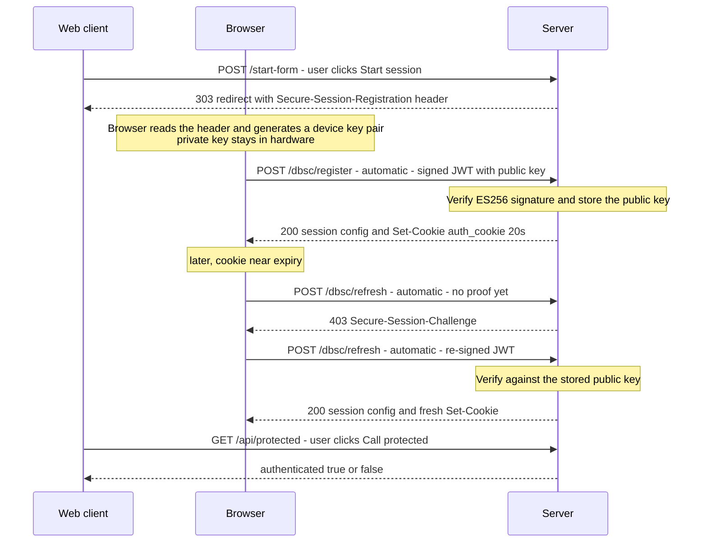

# DBSC hello-world

A minimal Rust (axum) HTTPS server that makes the **Device Bound Session Credentials
(DBSC)** handshake *visible*, so you can learn it by watching real requests. Every DBSC
header is logged to the terminal.

---

## 1. What DBSC is (the 60-second version)

Cookie theft is a big account-takeover vector: malware copies your session cookie and
replays it from the attacker's machine. **DBSC** defeats replay by binding a session to a
**private key that lives in the device's hardware** (Secure Enclave on macOS, TPM on
Windows) and never leaves it.

- On login, the **browser** generates a device key pair and proves possession of the
  private key by signing a challenge. The server stores the **public** key.
- The server issues a **short-lived** cookie (e.g. 20s here).
- Just before that cookie expires, the browser **automatically** re-proves possession
  (signs a fresh challenge) to get a new cookie — no page JavaScript involved.

A thief who copies only the cookie can't refresh it (they don't have the private key), so
the stolen session dies within seconds on their machine.

The whole crypto dance is done by the browser. **The server just:** (1) invites
registration, (2) verifies the signed proof and sets a cookie, (3) re-verifies on refresh.

---

## 2. Endpoints (5)

| Method & path         | Who calls it            | What it does |
|-----------------------|-------------------------|--------------|
| `GET  /`              | Web client (you)        | Serves the demo page. |
| `POST /start-form`    | Web client (Start session button) | Replies **303 → `/`** with a `Secure-Session-Registration` header + a `dbsc-registration-sessions-id` correlation cookie. This response is what makes the browser start DBSC. |
| `POST /dbsc/register` | **Browser (automatic)** | Receives the signed proof JWT (`Secure-Session-Response`). The JWT header embeds the device **public key** (`jwk`). We verify the ES256 signature, store the key under a new `session_identifier`, and return the **session config** JSON + a short-lived bound cookie. |
| `POST /dbsc/refresh`  | **Browser (automatic)** | Called when the bound cookie needs refreshing. First hit has no proof → we reply **403 + `Secure-Session-Challenge`**. The browser re-signs (same device key) and retries → we verify against the **stored** key and re-mint the cookie. Unknown session → **404** (drops stale sessions). |
| `GET  /api/protected` | Web client (Call protected button) | Reports whether the device-bound cookie was delivered (`authenticated: true/false`). |

Header names are `Secure-Session-*` (the spec renamed them from the old `Sec-Session-*`;
Chrome's public docs are stale). Session id on refresh is `Sec-Secure-Session-Id`.

---

## 3. The flow (sequence diagram)

Three participants: **Web client** = the page / user-initiated requests · **Browser** =
Chrome's DBSC engine making calls automatically, no user action · **Server** = this app.



Plain-text version:

```
You → POST /start-form
Server → 303 /  + Secure-Session-Registration            (invite)
Chrome makes a device key pair (private key in hardware)
Chrome → POST /dbsc/register  (Secure-Session-Response = signed JWT + public key)
Server verifies signature, stores public key, → 200 config + Set-Cookie auth_cookie (20s)
... cookie about to expire ...
Chrome → POST /dbsc/refresh   (Sec-Secure-Session-Id, no proof)
Server → 403 + Secure-Session-Challenge
Chrome → POST /dbsc/refresh   (Secure-Session-Response = re-signed JWT)
Server verifies vs stored key, → 200 config + fresh Set-Cookie
```

---

## 4. Setup & run

DBSC needs **real TLS** (not `http://localhost`) and several Chrome flags. On macOS all of
the following were required — each was a separate dead-end during development.

**a) Trusted HTTPS cert** (self-signed throws errors DBSC also rejects):
```bash
brew install mkcert
mkcert -install                      # add a local CA to the system keychain
mkcert localhost 127.0.0.1 ::1       # creates localhost+2.pem / localhost+2-key.pem
```

**b) Chrome flags** (`chrome://flags`, then **Relaunch**):
- **Device Bound Session Credentials (Standard)** → **`Enabled – For developers`**
  (plain "Enabled" still requires an Origin-Trial token that `localhost` can't have;
  "For developers" skips that check)
- **Enable UnexportableKeyService mojo service in the browser process** → **`Enabled`**
  (`#use-unexportable-key-service-in-browser-process`) — lets macOS generate the device
  key; without it registration silently fails
- **Device Bound Session Credentials (Standard) Persistence** → Enabled
- *(optional)* **… DevTools Debugging** → Enabled

**c) Run & open:**
```bash
cargo run
```
Open **`https://localhost:3000`** (exactly `localhost`, not `127.0.0.1`/a LAN host).
Open DevTools → Network, click **Start session**, watch the terminal.

Tip: if you've been testing a lot, DevTools → **Application → Clear site data** to drop
old persisted DBSC sessions before a fresh run.

---

## 5. What works vs. what doesn't

### ✅ Works (verified in the server logs)
- **Registration** — Chrome generates a device key, signs a JWT (`typ: dbsc+jwt`), and the
  server **verifies the ES256 signature** (`verified: true`), then issues the bound cookie.
- **Refresh** — the full anti-theft cycle: `403 Secure-Session-Challenge` → Chrome
  **re-signs with the same device key** → server verifies **against the stored key** →
  re-mints the cookie. This is the core DBSC mechanism, and it runs end to end.
- **Stale-session handling** — unknown session ids get `404`, so old persisted sessions
  are dropped instead of causing a refresh storm.

### ❌ Doesn't work on this setup
- **`/api/protected` shows `authenticated=false`.** The device-bound cookie is delivered
  to Chrome's own `/dbsc/refresh` requests, but **not** to our page's requests (tried both
  `fetch()` and a top-level navigation; not a SameSite/Domain issue). Chrome keeps
  re-refreshing without ever treating the bound cookie as "settled" for app requests.

### Why (best current understanding)
DBSC's *public* rollout is Windows-first; **macOS is still "manual testing"**, which
requires the **software-keys / UnexportableKeyService** path. That path is explicitly
"not secure" and exists to exercise the **protocol** (register/refresh), not full
production cookie-binding. On it, the last mile — attaching the bound cookie to the
application's own requests — doesn't complete on `localhost`. Notably, the official
reference server (`drubery/dbsc-test-server`) has **no protected endpoint at all** — these
localhost demos demonstrate the *handshake*, not app-request cookie delivery. So the
`authenticated=true` green light is a demo convenience this testing configuration won't
light up; the DBSC protocol itself is nonetheless demonstrably working.

Likely ways to get delivery working (untested here): run on a **real HTTPS domain with a
production/CT cert** and hardware keys, or on **Windows** where DBSC is generally available.

---

## 6. Key learnings (the gotchas, condensed)

1. **HTTPS is mandatory** — `http://localhost` is a "secure context" but not a
   *cryptographic* transport, so Chrome silently ignores the registration header.
2. **The cert must be trusted** — use `mkcert`, not a bare self-signed cert.
3. **`Enabled – For developers`**, not plain "Enabled" (skips the Origin-Trial-token gate
   that blocks localhost).
4. **UnexportableKeyService flag** is required on macOS to generate the device key.
5. **Header names are `Secure-Session-*`** (registration/response/challenge) and
   `Sec-Secure-Session-Id`. The Chrome docs get this right; lots of *older blog posts /
   search results* still show the obsolete `Sec-Session-*` — don't copy those.
6. **Registration must ride a form-POST → 303**; Chrome ignores the header on a plain GET
   navigation or a `fetch()` response.
7. **Refresh challenge must return `403`** (not 401) — Chrome only re-signs on 403.
8. **Challenges should be short & alphanumeric** — Chrome is picky.
9. **Reject unknown sessions with `404`** or persisted sessions cause an infinite
   refresh storm after a server restart.
10. **Bound cookies need `Domain=`** to match the domain-based session scope.

---

## 7. How this differs from the Chrome docs

Compared against
[Chrome's DBSC guide](https://developer.chrome.com/docs/web-platform/device-bound-session-credentials).
First, the important correction: **the Chrome docs are actually correct on the header
names** — `Secure-Session-Registration`, `Secure-Session-Response`,
`Secure-Session-Challenge`, and `Sec-Secure-Session-Id`. (An early failure here was
self-inflicted: the first version used the obsolete `Sec-Session-*` names from memory,
which Chrome silently ignores. The docs never said that.)

### Where we follow the docs exactly
- **Header names** (all `Secure-Session-*` / `Sec-Secure-Session-Id`).
- **Refresh flow**: server challenges with **`403` + `Secure-Session-Challenge`**, the
  browser retries with `Secure-Session-Response`, server returns `200` + fresh cookie.
- **Session-config JSON** shape: `session_identifier`, `refresh_url`, `scope`
  (`origin` / `include_site` / `scope_specification`), `credentials`.
- **HTTPS required.**

### Where we differ, and why

| # | Chrome docs | This project | Why |
|---|-------------|--------------|-----|
| 1 | Emits `Secure-Session-Registration` on the **login response** (`200` + a long-lived cookie). | Emits it on a **form-POST → `303` redirect** (the *Start session* button). | A hello-world has no real login. A button submitting a form is the simplest trigger, and the `303`-redirect shape (matching the reference test server) is what reliably makes Chrome start registration. Functionally it's still "a POST whose response carries the header." |
| 2 | Registration header example: `(ES256 RS256); path="/StartSession"` — **no `challenge`**. | We add `challenge="…"` and `authorization="…"`. | The `challenge` is echoed back in the JWT's `jti`, which is how a real server does anti-replay; both are permitted by the [spec](https://w3c.github.io/webappsec-dbsc/). Harmless to include. |
| 3 | Bound cookie: `Max-Age=600` (10 min), `SameSite=Lax`, `Secure`. | `Max-Age=20`, `SameSite=Strict`, no `Secure`. | 20s makes the auto-refresh observable within seconds. `Strict`/no-`Secure` matched the reference server; the docs note `Secure` isn't strictly required. |
| 4 | **No enablement steps** (it documents shipped/production behavior). | Requires Chrome flags: **`Enabled – For developers`**, **UnexportableKeyService**, software-keys. | On macOS, DBSC is still "manual testing"; those flags (from the [testing wiki](https://github.com/w3c/webappsec-dbsc/wiki/Testing-early-versions-of-DBSC)) skip the Origin-Trial-token check and let the OS generate the device key. Without them Chrome silently does nothing on `localhost`. |
| 5 | Describes an optional **long-lived fallback cookie** for when refresh fails. | Not implemented. | Out of scope for a minimal demo. |
| 6 | Barely specifies the **JWT** ("a public key in a JWT"). | We parse it fully: read the EC `jwk` from the JWT header at registration, verify ES256; on refresh verify against the **stored** key. | The docs punt JWT details to the spec; we implemented them so the proof is actually checked. |
| 7 | Doesn't discuss server session lifecycle. | We **reject unknown sessions with `404`**. | Our session store is in-memory and resets on restart, but the browser persists sessions — without the `404` those stale sessions refresh forever (a storm). |
| 8 | Implies the bound cookie is delivered to your app's requests. | On this setup it is **not** (see §5). | The macOS software-keys/localhost testing path exercises the handshake but doesn't complete production cookie-binding to app requests. |

---

## 8. Files & references

- `src/main.rs` — the whole server (~5 handlers + JWT/ES256 verification), heavily commented.
- `localhost+2*.pem` — mkcert TLS cert/key (git-ignored via the parent repo).
- Reference server to diff against: <https://github.com/drubery/dbsc-test-server>
- Spec: <https://w3c.github.io/webappsec-dbsc/> ·
  Testing guide: <https://github.com/w3c/webappsec-dbsc/wiki/Testing-early-versions-of-DBSC> ·
  Chrome docs: <https://developer.chrome.com/docs/web-platform/device-bound-session-credentials>
