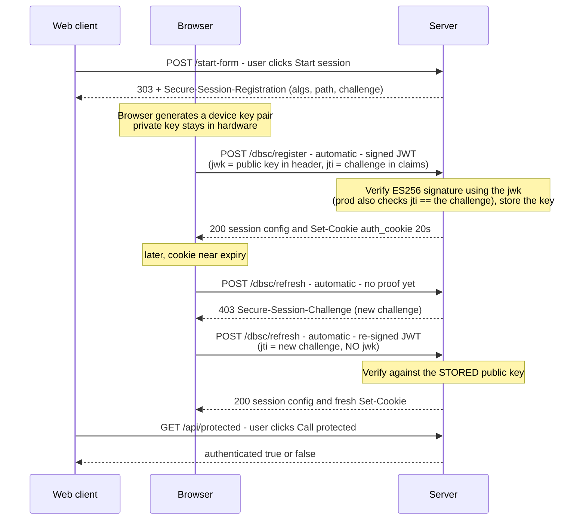

# DBSC hello-world

A minimal Rust (axum) HTTPS server that makes the **Device Bound Session Credentials
(DBSC)** handshake *visible*, so you can learn it by watching real requests. Every DBSC
header is logged to the terminal.

---

## 1. What DBSC is (the 60-second version)

Cookie theft is a big account-takeover vector: malware copies your session cookie and
replays it from the attacker's machine. **DBSC** defeats replay by binding a session to a
**private key that lives in the device's hardware** (Secure Enclave on macOS, TPM on
Windows) and never leaves it.

- On login, the **browser** generates a device key pair and proves possession of the
  private key by signing a challenge. The server stores the **public** key.
- The server issues a **short-lived** cookie (e.g. 20s here).
- Just before that cookie expires, the browser **automatically** re-proves possession
  (signs a fresh challenge) to get a new cookie — no page JavaScript involved.

A thief who copies only the cookie can't refresh it (they don't have the private key), so
the stolen session dies within seconds on their machine.

The whole crypto dance is done by the browser. **The server just:** (1) invites
registration, (2) verifies the signed proof and sets a cookie, (3) re-verifies on refresh.

---

## 2. Endpoints (5)

| Method & path         | Who calls it            | What it does |
|-----------------------|-------------------------|--------------|
| `GET  /`              | Web client (you)        | Serves the demo page. |
| `POST /start-form`    | Web client (Start session button) | Replies **303 → `/`** with a `Secure-Session-Registration` header + a `dbsc-registration-sessions-id` correlation cookie. This response is what makes the browser start DBSC. |
| `POST /dbsc/register` | **Browser (automatic)** | Receives the signed proof JWT (`Secure-Session-Response`). The JWT **header** embeds the device **public key** as a `jwk`; the **claims** echo our challenge back as the `jti`. We verify the ES256 signature, store the key under a new `session_identifier`, and return the **session config** JSON + a short-lived bound cookie. |
| `POST /dbsc/refresh`  | **Browser (automatic)** | Called when the bound cookie needs refreshing. First hit has no proof → we reply **403 + `Secure-Session-Challenge`**. The browser re-signs (same device key; new challenge as `jti`, **no `jwk`**) and retries → we verify against the **stored** key and re-mint the cookie. Unknown session → **404** (drops stale sessions). |
| `GET  /api/protected` | Web client (Call protected button) | Reports whether the device-bound cookie was delivered (`authenticated: true/false`). |

Header names are `Secure-Session-*`; Chrome's docs get these right — it's older blog posts
/ search results that still show the obsolete `Sec-Session-*` (don't copy those). Session
id on refresh is `Sec-Secure-Session-Id`.

---

## 3. The flow (sequence diagram)

Three participants: **Web client** = the page / user-initiated requests · **Browser** =
Chrome's DBSC engine making calls automatically, no user action · **Server** = this app.



Plain-text version:

```
You → POST /start-form
Server → 303 /  + Secure-Session-Registration            (invite: algs, path, challenge)
Chrome makes a device key pair (private key in hardware)
Chrome → POST /dbsc/register  (Secure-Session-Response = signed JWT;
                               jwk = public key in header, jti = challenge in claims)
Server verifies signature via the jwk, stores the public key, → 200 config + Set-Cookie (20s)
... cookie about to expire ...
Chrome → POST /dbsc/refresh   (Sec-Secure-Session-Id, no proof)
Server → 403 + Secure-Session-Challenge   (a new challenge)
Chrome → POST /dbsc/refresh  (Secure-Session-Response = re-signed JWT;
                              jti = new challenge, NO jwk — key already stored)
Server verifies vs stored key, → 200 config + fresh Set-Cookie
```

**What's inside the proof JWT** (a compact JWS — `header.payload.signature`):

- **`jwk`** (in the JWT *header*) — the device's **public** key (EC P-256 `x`/`y` coordinates).
  Sent **only at registration**; the private half never leaves the hardware. The server stores
  this jwk and verifies every future proof against it. On **refresh there is no `jwk`** — the
  key is already known, so re-sending it would defeat the point.
- **`jti`** (a JWT *claim*) — the **challenge** the server issued, echoed back. It proves the
  signature is **fresh**, not a replay. Present on **both** the register and refresh JWTs (each
  carries whatever challenge the server most recently issued). A production server checks
  `jti == the challenge it sent`; this demo logs it (see §5). The signature covers
  `header.payload`, so a valid signature proves possession of the private key *and* binds this
  exact challenge.

### The three IDs (and how long each lives) — don't mix them up

DBSC juggles three different identifiers. Confusing them is the #1 source of "wait, which id
is this?" — here's each, side by side:

| Identifier | Example | Changes? | What it's for |
|------------|---------|----------|---------------|
| **`session_identifier`** (the "session id") | `sess12` | **Stable for the whole login session** — same across every refresh | The handle the server uses to find the **stored device key** for a session. Chrome sends it back on each refresh (`Sec-Secure-Session-Id`). |
| **bound cookie value** | `cookie13` → `cookie15` → … | **Rotates on every refresh** (must!) | The short-lived, device-bound **credential** itself. Re-emitting the old value makes Chrome think no refresh happened and drop the session. |
| **correlation cookie** (`dbsc-registration-sessions-id`) | `regid11` | Set once at the trigger | Links the register POST back to the login. This demo *sets* it but doesn't *read* it (see §7). |

#### What "the session id is stable" really means

The `session_identifier` is created **once, at registration**, and then **reused for the
entire life of that login session** — through every automatic refresh, even if the user
closes the tab and comes back days later. It is **not** regenerated on refresh (only the
*cookie value* is). Think of it as a **handle to a server-side binding**
(`session_identifier → device public key`), and that binding lives as long as the login
session does.

So it is *stable per login session*, **not** a permanent per-user value:

- **Same login session** (refreshes, tab closed & reopened, returning after days while the
  session is still valid) → **same `session_identifier`**. The bound cookie has expired, but
  Chrome silently refreshes it under the same id — no re-login, invisible to the user.
- **A new login** (the previous session expired, the user logged out, or you revoked it) →
  a **brand-new registration → brand-new `session_identifier`** bound to a fresh key proof.
  You do **not** reuse the old id for a new login — each session gets its own (so you can
  revoke them independently); the reference servers even *reject* re-registering an
  already-bound session.

**The rule in one line:** one login session ↔ one `session_identifier`. Stable while that
session lives; new only when the user registers again. Its lifetime is **your** decision — it
lives exactly as long as the server-side binding, which you tie to your login/session TTL
(a 30-day "remember me" keeps the same id for weeks; a short session rotates it sooner).

> In this demo there is no real login, so the store is keyed directly by the
> `session_identifier` and every "Start session" click is a brand-new session. A production
> server keys its binding by the **stable app session id** instead, and treats the
> `session_identifier` as a separate nonce the browser echoes back (see §9.3).

### The two "path"s in Flow 1 are unrelated

Flow 1's response has two tokens that both say "path" — they live on **different headers** and
mean **completely different things**. The name collision trips everyone up:

```
Secure-Session-Registration: (ES256); path="/dbsc/register"; challenge="…"   ← header #1
Set-Cookie: dbsc-registration-sessions-id=regid11; Path=/; Max-Age=3600       ← header #2
```

| Token | On which header | Kind | What it means |
|-------|-----------------|------|---------------|
| `path="/dbsc/register"` | `Secure-Session-Registration` | a **DBSC parameter** | The **endpoint** Chrome should POST the signed proof JWT to. |
| `Path=/` | `Set-Cookie` | a **standard cookie attribute** ([RFC 6265](https://datatracker.ietf.org/doc/html/rfc6265)) | The **URL scope** of the correlation cookie — which requests the browser attaches it to. |

- `path="/dbsc/register"` is a DBSC *instruction* ("post your proof here"). Lowercase, and it's
  a parameter of the registration structured field.
- `Path=/` is ordinary cookie plumbing, nothing DBSC-specific ("send this cookie on any URL
  under `/`"). It's `/` here so the correlation cookie is guaranteed to ride along on the very
  next request — the `POST /dbsc/register` — which is how the reference server correlates that
  call back to the login. (This demo sets the cookie but doesn't read it — see §7.)

So one is "**where to send the proof**", the other is "**which URLs this cookie is sent for**".

---

## 4. Setup & run

DBSC needs **real TLS** (not `http://localhost`) and several Chrome flags. On macOS all of
the following were required — each was a separate dead-end during development.

**a) Trusted HTTPS cert** (self-signed throws errors DBSC also rejects):
```bash
brew install mkcert
mkcert -install                      # add a local CA to the system keychain
mkcert localhost 127.0.0.1 ::1       # creates localhost+2.pem / localhost+2-key.pem
```

**b) Chrome flags** (`chrome://flags`, then **Relaunch**):
- **Device Bound Session Credentials (Standard)** → **`Enabled – For developers`**
  (plain "Enabled" still requires an Origin-Trial token that `localhost` can't have;
  "For developers" skips that check)
- **Enable UnexportableKeyService mojo service in the browser process** → **`Enabled`**
  (`#use-unexportable-key-service-in-browser-process`) — lets macOS generate the device
  key; without it registration silently fails
- **Device Bound Session Credentials (Standard) Persistence** → Enabled
- *(optional)* **… DevTools Debugging** → Enabled

**c) Run & open:**
```bash
cargo run
```
Open **`https://localhost:3000`** (exactly `localhost`, not `127.0.0.1`/a LAN host).
Open DevTools → Network, click **Start session**, watch the terminal.

Tip: if you've been testing a lot, DevTools → **Application → Clear site data** to drop
old persisted DBSC sessions before a fresh run.

---

## 5. What works vs. what doesn't

### ✅ Works (verified in the server logs)
- **Registration** — Chrome generates a device key, signs a JWT (`typ: dbsc+jwt`), and the
  server **verifies the ES256 signature** (`verified: true`), then issues the bound cookie.
- **Refresh** — the full anti-theft cycle: `403 Secure-Session-Challenge` → Chrome
  **re-signs with the same device key** → server verifies **against the stored key** →
  re-mints the cookie. This is the core DBSC mechanism, and it runs end to end.
- **Stale-session handling** — unknown session ids get `404`, so old persisted sessions
  are dropped instead of causing a refresh storm.

### ❌ Doesn't work on this setup
- **`/api/protected` shows `authenticated=false`.** The device-bound `auth_cookie` is **never
  attached to any request** — not our page's `/api/protected`, and **not even** Chrome's own
  `/dbsc/refresh` (which identifies the session via `Sec-Secure-Session-Id`, not the cookie).
  Chrome keeps re-refreshing but never delivers the bound cookie to a request.
  **What this rules in:** ordinary cookies work fine on this origin — the plain
  `dbsc-registration-sessions-id` correlation cookie rides *every* request (register, refresh,
  **and** `/api/protected`, visible in the logs). So the blocker is specific to the
  **DBSC-managed** cookie, not cookies in general. *(An earlier version of this note claimed the
  bound cookie was delivered to `/dbsc/refresh`; logging the incoming `Cookie:` header on every
  flow showed it isn't — the correlation cookie is the only cookie on those requests.)*

  **Ruled out (things we tried that made no difference):** `fetch()` vs. top-level
  navigation; `SameSite=Lax` vs. `Strict`; `Domain=localhost` vs. host-only; and the strict
  **`__Host-` prefix** (`Secure` + `HttpOnly`, no `Domain`, per
  [RFC 6265bis §4.1.3.2](https://datatracker.ietf.org/doc/html/draft-ietf-httpbis-rfc6265bis-05#section-4.1.3.2)).
  None changed delivery — which is strong evidence the blocker is **not** a cookie-attribute
  problem but the testing path below.

### Why (best current understanding)
DBSC's *public* rollout is Windows-first; **macOS is still "manual testing"**, which
requires the **software-keys / UnexportableKeyService** path. That path is explicitly
"not secure" and exists to exercise the **protocol** (register/refresh), not full
production cookie-binding. On it, the last mile — attaching the bound cookie to the
application's own requests — doesn't complete on `localhost`. Notably, the official
reference server (`drubery/dbsc-test-server`) has **no protected endpoint at all** — these
localhost demos demonstrate the *handshake*, not app-request cookie delivery. So the
`authenticated=true` green light is a demo convenience this testing configuration won't
light up; the DBSC protocol itself is nonetheless demonstrably working.

Likely ways to get delivery working (untested here): run on a **real HTTPS domain with a
production/CT cert** and hardware keys, or on **Windows** where DBSC is generally available.

---

## 6. Key learnings (the gotchas, condensed)

1. **HTTPS is mandatory** — `http://localhost` is a "secure context" but not a
   *cryptographic* transport, so Chrome silently ignores the registration header.
2. **The cert must be trusted** — use `mkcert`, not a bare self-signed cert.
3. **`Enabled – For developers`**, not plain "Enabled" (skips the Origin-Trial-token gate
   that blocks localhost).
4. **UnexportableKeyService flag** is required on macOS to generate the device key.
5. **Header names are `Secure-Session-*`** (registration/response/challenge) and
   `Sec-Secure-Session-Id`. The Chrome docs get this right; lots of *older blog posts /
   search results* still show the obsolete `Sec-Session-*` — don't copy those.
6. **Registration must ride a form-POST → 303**; Chrome ignores the header on a plain GET
   navigation or a `fetch()` response.
7. **Refresh challenge must return `403`** (not 401) — Chrome only re-signs on 403.
8. **Challenges should be short & alphanumeric** — Chrome is picky.
9. **Reject unknown sessions with `404`** or persisted sessions cause an infinite
   refresh storm after a server restart.
10. **`Domain=` is *not* required for the bound cookie.** We use a **host-only** cookie with
    `Secure` + `HttpOnly` (matching the production `dbsc-php` lib). The two references
    disagree here — `drubery` uses `Domain=`, `dbsc-php` uses host-only + `Secure` +
    `HttpOnly` — and both handshake fine. (An earlier version of this list wrongly claimed
    `Domain=` was required; it isn't.)
11. **Bound cookie uses `SameSite=Lax`, not `Strict`.** `Secure` + `HttpOnly` are always right
    for a session cookie. For `SameSite`, `Lax` is the better default: `Strict` would drop the
    cookie when a user arrives via an **external top-level link** (they'd look logged out until
    they navigate internally) — a real login-UX cost for no meaningful gain on a
    hardware-bound, refreshed-every-few-minutes cookie. The Chrome docs and both reference libs
    all use `Lax`. Reserve `Strict` for a separate, extra-sensitive cookie (e.g. a step-up
    token). *(This demo originally used `Strict`; we switched to `Lax` to match the references —
    it made no difference to delivery, see §5.)*

---

## 7. How this differs from the Chrome docs

Compared against
[Chrome's DBSC guide](https://developer.chrome.com/docs/web-platform/device-bound-session-credentials).
First, the important correction: **the Chrome docs are actually correct on the header
names** — `Secure-Session-Registration`, `Secure-Session-Response`,
`Secure-Session-Challenge`, and `Sec-Secure-Session-Id`. (An early failure here was
self-inflicted: the first version used the obsolete `Sec-Session-*` names from memory,
which Chrome silently ignores. The docs never said that.)

### Where we follow the docs exactly
- **Header names** (all `Secure-Session-*` / `Sec-Secure-Session-Id`).
- **Refresh flow**: server challenges with **`403` + `Secure-Session-Challenge`**, the
  browser retries with `Secure-Session-Response`, server returns `200` + fresh cookie.
- **Session-config JSON** shape: `session_identifier`, `refresh_url`, `scope`
  (`origin` / `include_site` / `scope_specification`), `credentials`.
- **HTTPS required.**

### Where we differ, and why

| # | Chrome docs | This project | Why |
|---|-------------|--------------|-----|
| 1 | Emits `Secure-Session-Registration` on the **login response** (`200` + a long-lived cookie). | Emits it on a **form-POST → `303` redirect** (the *Start session* button). | A hello-world has no real login. A button submitting a form is the simplest trigger, and the `303`-redirect shape (matching the reference test server) is what reliably makes Chrome start registration. Functionally it's still "a POST whose response carries the header." |
| 2 | Registration header example: `(ES256 RS256); path="/StartSession"` — **no `challenge`**. | We add `challenge="…"` and `authorization="…"`. | The `challenge` is echoed back in the JWT's `jti`, which is how a real server does anti-replay; both are permitted by the [spec](https://w3c.github.io/webappsec-dbsc/). Harmless to include. |
| 3 | Bound cookie: `Max-Age=600` (10 min), `SameSite=Lax`, `Secure`. | `Max-Age=20`, `SameSite=Lax`, `Secure`, `HttpOnly`, host-only (no `Domain`). | 20s makes the auto-refresh observable within seconds. `SameSite=Lax` matches the docs; `Secure`+`HttpOnly`+host-only matches the production lib [`report-uri/dbsc-php`](https://github.com/report-uri/dbsc-php). |
| 4 | **No enablement steps** (it documents shipped/production behavior). | Requires Chrome flags: **`Enabled – For developers`**, **UnexportableKeyService**, software-keys. | On macOS, DBSC is still "manual testing"; those flags (from the [testing wiki](https://github.com/w3c/webappsec-dbsc/wiki/Testing-early-versions-of-DBSC)) skip the Origin-Trial-token check and let the OS generate the device key. Without them Chrome silently does nothing on `localhost`. |
| 5 | Describes an optional **long-lived fallback cookie** for when refresh fails. | Not implemented. | Out of scope for a minimal demo. |
| 6 | Barely specifies the **JWT** ("a public key in a JWT"). | We parse it fully: read the EC `jwk` from the JWT header at registration, verify ES256; on refresh verify against the **stored** key. | The docs punt JWT details to the spec; we implemented them so the proof is actually checked. |
| 7 | Doesn't discuss server session lifecycle. | We **reject unknown sessions with `404`**. | Our session store is in-memory and resets on restart, but the browser persists sessions — without the `404` those stale sessions refresh forever (a storm). |
| 8 | Implies the bound cookie is delivered to your app's requests. | On this setup it is **not** (see §5). | The macOS software-keys/localhost testing path exercises the handshake but doesn't complete production cookie-binding to app requests. |

### vs. the official reference server ([drubery/dbsc-test-server](https://github.com/drubery/dbsc-test-server))

This is the Chrome team's reference DBSC test server (TypeScript/Deno, live at
`https://drubery-dbsc-test-server.deno.dev/`). **Our implementation is modeled on it** —
the two things that differ from the Chrome-doc example (the **form-POST→`303` trigger** and
the **`challenge` parameter**) come straight from this server, and it uses the same
`Secure-Session-*` headers and `403` refresh. So "our way" *is* essentially "the reference
way." Where we differ, it's because **we simplified** or because we run on **localhost**:

| Aspect | Reference server | This project | Why we differ |
|--------|------------------|--------------|---------------|
| Correlation cookie `dbsc-registration-sessions-id` | Sets it in the form handler **and reads it** in `/register` to look up the pending session. | We **set it but don't read it** — `/register` just mints a fresh `session_identifier`. | Kept the demo minimal; correlation isn't needed when we create the session on the fly. |
| JWT claim checks | Verifies signature **and** that `jti` == the issued challenge and `authorization` == the auth code. | We verify the **signature only** (log the claims). | Simpler to read; the signature is the core proof-of-possession. |
| Enablement | Ships an **Origin-Trial token** (`origin-trial` header) valid for its real `deno.dev` domain. | Uses **Chrome testing flags** on `localhost`. | `localhost` can't carry a domain-bound OT token, so we take the flags door instead. |
| Scope / cookie config | A form lets you set scope include/exclude paths, cookie name/value/lifetime at runtime. | **Hardcoded** (whole-origin scope, `auth_cookie`, 20s). | A hello-world doesn't need the knobs. |
| Protected endpoint | **None** — it only shows a session table. | We added **`/api/protected`** to test cookie delivery. | To make "is the bound cookie delivered?" observable (which surfaced the §5 limitation). |
| Language / stack | TypeScript on Deno; `fast-jwt` + `jwkToPem`. | Rust on axum; `p256` for ES256. | Personal preference / learning in Rust. |

**Bottom line:** the reference is the more complete, production-shaped implementation; ours
is a trimmed-down, heavily-commented Rust port of the same protocol, plus a protected
endpoint to probe cookie delivery.

### vs. the production PHP library ([report-uri/dbsc-php](https://github.com/report-uri/dbsc-php))

Where `drubery` is Chrome's reference *test server*, `dbsc-php` is a **production** library —
Report URI's real DBSC integration, extracted as a framework-agnostic package (PHP 8.1+,
~700 lines, zero deps beyond `ext-openssl`). It's the source of this project's **security
hardening**, so comparing against it shows exactly how much a *demo* omits versus a real
server.

**What we deliberately share with it** (our hardening follows it): single-phase register /
two-phase (`403`→`200`) refresh · `Secure-Session-*` headers with the `id` sf-parameter on
the challenge · offering only `(ES256)` in the registration header (not the Chrome docs'
`(ES256 RS256)`) · a host-only `Secure`+`HttpOnly` bound cookie · **ES256 pinned** to block
`alg` confusion (`none` / RS-with-EC-key) · a **fresh cookie value minted on every refresh**
(re-emitting the old value makes Chrome think no refresh happened and drop the session).

| Aspect | `dbsc-php` (production) | This project (demo) | Why we differ |
|--------|------------------------|---------------------|---------------|
| Shape | Framework-agnostic **library**: `DbscServer` takes a `RequestContext`, returns a `DbscResponse`; never touches globals / headers / cookies itself. | A **runnable HTTPS server** you `cargo run`. | We want something you can launch and watch, not embed. |
| Stack | PHP 8.1+, `ext-openssl`. | Rust + axum, `p256`. | Learning in Rust. |
| Storage | Your `StoreInterface` (Redis / table), keyed by the **stable app session id** in a **dedicated key space** — never a shared session blob (a race there clobbers the binding and silently disables enforcement). | In-memory `HashMap` keyed by the **DBSC `session_identifier`**, cleared on restart. | A hello-world has no login / app-session; the map is enough to demo register→refresh. |
| JWT checks | **Rejects** (throws) on bad signature, wrong / expired challenge (`jti` vs stored, constant-time), or `alg≠ES256`. | Pins `alg=ES256` and *computes* signature validity, but **logs & continues** — never rejects; `jti` not checked. | Deliberate demo shortcut so even a failed check still shows the flow. A real server must reject — the code comment says exactly this. |
| Challenge | 32 crypto-random bytes, single-use; `challengeTtl` **must exceed `cookieMaxAge`** (enforced in `Config`) so a challenge cached just before expiry still validates. | Monotonic counter (`chal1`, `chal2`, …), not verified. | Not security-relevant in a demo; short & alphanumeric keeps Chrome happy. |
| Registration header | `(ES256); path="/dbsc/register"; challenge="…"` — **no** `authorization`. | Same, but we add `authorization="auth-code-123"`. | Both are spec-legal; we include it to show where an auth code would ride. |
| Bound cookie | `__Host-dbsc` (default), `Max-Age=300`, `SameSite=Lax`. | `auth_cookie`, `Max-Age=20`, `SameSite=Lax`. | 20s makes the auto-refresh observable in seconds. We tried the `__Host-` prefix (see §5) — it made no difference to delivery here, so we kept a plain host-only name. |
| `scope` JSON | `origin` + `include_site:false`, **no `scope_specification`** (a `__Host-` cookie can't span subdomains anyway). | `origin` + `include_site:false` + an explicit `scope_specification` **include** rule. | Both work; we keep the explicit rule to make the scope visible. |
| Enforcement | Full gate **primitives**: `getBinding`, constant-time `boundCookieMatches` (with a single-depth previous-value overlap for refresh races), document-vs-subresource, a registration grace window. The caller wires the policy. | None — just `/api/protected` reporting whether the cookie rode along. | We only *probe* delivery (which surfaced the §5 limitation); we don't gate. |
| Refresh robustness | Single-depth **challenge + cookie overlap** windows for latency races; an optional single-phase **first** refresh via `advertiseRefreshChallenge`. | Straight `403`→proof→`200`, fresh cookie each time, no overlap. | Those windows matter under real network latency, not on loopback. |
| Revoke / logout | `revoke()` deletes state + emits a cookie deletion (distinct enforcement-terminated vs logout audit events). | Not implemented. | Out of scope for the demo. |
| Audit + tests | `AuditLoggerInterface` events; a self-contained attack-case harness (wrong device key, wrong / expired challenge, stale cookie, `alg=none`). | `println!` to stdout; no tests. | The whole point here is *visibility in the terminal*, not coverage. |

**Bottom line:** `dbsc-php` is what a **correct, production** DBSC server looks like —
rejection on every failed check, real storage discipline, an enforcement gate, revocation,
latency-race overlap windows, and attack tests. This project is a **single-file demo** that
speaks the same wire protocol and borrows `dbsc-php`'s crypto / cookie hardening, but
deliberately *logs-and-continues* instead of enforcing, so you can watch every step. Building
the real thing → read `dbsc-php`; learning the handshake → read this.

---

## 8. Files & references

- `src/main.rs` — the whole server (~5 handlers + JWT/ES256 verification), heavily commented.
- `localhost+2*.pem` — mkcert TLS cert/key (git-ignored via the parent repo).
- Reference servers to diff against: <https://github.com/drubery/dbsc-test-server> (Chrome
  team's Deno test server) and <https://github.com/report-uri/dbsc-php> (production PHP lib
  with an attack-case test harness; our JWT/cookie hardening follows it)
- Spec: <https://w3c.github.io/webappsec-dbsc/> ·
  Testing guide: <https://github.com/w3c/webappsec-dbsc/wiki/Testing-early-versions-of-DBSC> ·
  Chrome docs: <https://developer.chrome.com/docs/web-platform/device-bound-session-credentials>

---

## 9. Next steps (turning this demo into a real integration)

This is a hello-world: it demonstrates the *handshake* with a `Start session` button and
*logs-and-continues* instead of enforcing. To make it real, in rough priority order:

### 9.1 Fold registration into the real login — drop the button

There is **no** browser "call `/start-form`" step, and no client feature-detection. DBSC
registration is **server-triggered**: you attach the `Secure-Session-Registration` header to
a response your app *already* sends. The natural home is the **login response**.

- A real login is a **POST** of credentials, and usually already redirects on success
  (Post/Redirect/Get). Just **add the header to that response**:

  ```
  POST /login   (credentials)
  → 303 See Other
    Location: /dashboard
    Secure-Session-Registration: (ES256); path="/dbsc/register"; challenge="…"
    Set-Cookie: session=…          (your normal app session cookie)
  ```

- Status is `303`/`302` **or** `200` — whatever your login already returns. It is **not**
  `403`/`401` (those would make Chrome report a Challenge Error). `403` belongs only to the
  `/dbsc/refresh` challenge. Registration is single-phase; refresh is two-phase.
- The header **must ride the response to a POST navigation**, never a `fetch()`/XHR response
  or a plain GET (Chrome silently drops it there — see §6, learning 6). So the button here is
  a stand-in for the login POST; a real app deletes it and the `/start-form` handler and
  merges that `303`-with-header logic into `POST /login`.
- **No feature detection needed:** always send the header. DBSC-capable browsers register;
  others ignore it and continue on normal cookies (additive, can't lock anyone out).

### 9.2 Actually enforce (the security payoff — currently missing)

Today `/dbsc/register` and `/dbsc/refresh` **log** verification and continue. A real server
must:

- **Reject** on any failed check: `alg≠ES256`, bad signature, and `jti` ≠ the challenge we
  issued (and, at registration, the `authorization` code). Use constant-time comparison.
- Add an **enforcement gate** on protected routes: if a session is bound (a binding exists)
  but the request's bound cookie is missing/mismatched, **revoke + log the user out** — don't
  just report `authenticated:false`. Enforce on document loads *and* subresources past a short
  registration grace, and skip the gate on the `/dbsc/*` endpoints. (See `report-uri/dbsc-php`
  §7 for the exact primitives.)

### 9.3 Production-grade state & crypto

- **Real storage** keyed by a **stable session id** in a **dedicated key space** (Redis/DB),
  not an in-memory `HashMap` and not a shared session blob (the read-modify-write race
  clobbers the binding and silently disables enforcement).
- **Crypto-random, single-use challenges** (not the demo's monotonic counter), with
  `challengeTtl > cookieMaxAge` so a challenge cached just before cookie expiry still validates.
- **Revocation** on logout (delete state + emit a bound-cookie deletion).
- **Latency-race overlap windows** (accept the single previous cookie value / challenge during
  the refresh round-trip) so normal requests racing a refresh don't get spuriously logged out.

### 9.4 Get real cookie delivery working

The unresolved §5 limitation (bound cookie not delivered to app requests) is tied to the macOS
software-keys/localhost testing path. Retest on a **real HTTPS domain with hardware keys**, or
on **Windows** where DBSC is generally available, before trusting `/api/protected`.
